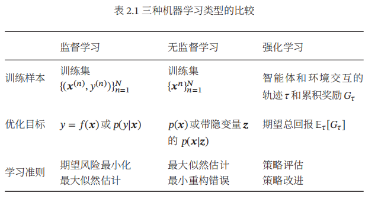
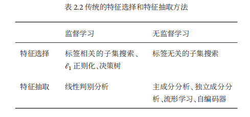
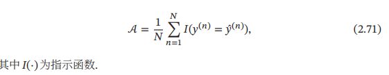
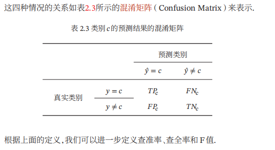
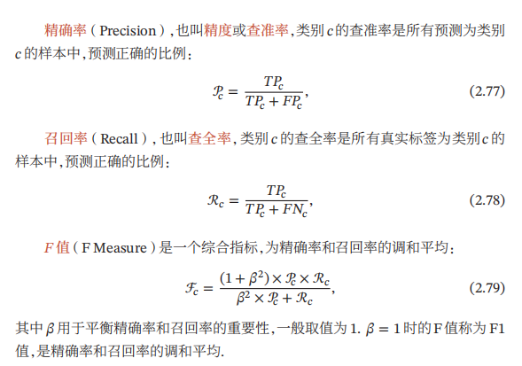

## 统计学方法
1. 最小二乘法  
2. 岭回归  
3. 最大似然估计  
4. 最大后验估计  
5. 偏差-方差分解  
   方差一般会随着训练样本的增加而减少. 当样本比较多时，方差比较少，这时可以选择能力强的模型来减少偏差.  
## 七、机器学习算法类型  
### 1. 监督学习（Supervised Learning）  
   如果机器学习的目标是通过建模样本的特征 𝒙 和标签 𝑦 之间的关系：𝑦 = 𝑓(𝒙; 𝜃) 或 𝑝(𝑦|𝒙; 𝜃)，并且训练集中每个样本都有标签，那么这类机器学习称为监督学习（Supervised Learning）.分为三类：  
   + 回归（Regression）问题中的标签 𝑦 是连续值（实数或连续整数），𝑓(𝒙; 𝜃)的输出也是连续值  
   + 分类（Classification）问题中的标签𝑦 是离散的类别（符号）. 在分类问题中，学习到的模型也称为分类器（Classifier）. 分类问题根据其类别数量又可分为二分类（Binary Classification）和多分类（Multi-class Classification）问题.  
   + 结构化学习（Structured Learning）问题的输出𝒚通常是结构化的对象，比如序列、树或图等.  
### 2. 无监督学习（Unsupervised Learning，UL）  
是指从不包含目标标签的训练样本中自动学习到一些有价值的信息. 典型的无监督学习问题有聚类、密度估计、特征学习、降维等.  
### 3. 强化学习 强化学习（Reinforcement Learning，RL）  
是一类通过交互来学习的机器学习算法. 在强化学习中，智能体根据环境的状态做出一个动作，并得到即时或延时的奖励. 智能体在和环境的交互中不断学习并调整策略，以取得最大化的期望总回报.  
  
## 八、数据的特征表示方法  
+ 特征工程（Feature Engineering）：一个成功的机器学习系统通常需要尝试大量的特征  
+ 特征学习/表示学习（Feature Learning）：让机器自动地学习出有效的特征也成为机器学习中的一项重要研究内容，称为特征学习，也叫表示学习（Representation Learning）. 特征学习在一定程度上也可以减少模型复杂性、缩短训练时间、提高模型泛化能力、避免过拟合等  
### 传统的特征学习  
+ 特征选择（Feature Selection）：是选取原始特征集合的一个有效子集，使得基于这个特征子集训练出来的模型准确率最高. 简单地说，特征选择就是保留有用特征，移除冗余或无关的特征.  
+ 子集搜索（Subset Search）  
   假设原始特征数为 𝐷，则共有 2𝐷 个候选子集. 特征选择的目标是选择一个最优的候选子集.最暴力的做法是测试每个特征子集，看机器学习模型哪个子集上的准确率最高.  
   + 由空集合开始，每一轮添加该轮最优的特征，称为前向搜索（Forward Search）；  
   + 或者从原始特征集合开始，每次删除最无用的特征，称为反向搜索（Backward Search）  
   + ℓ1 正则化 此外，我们还可以通过ℓ1 正则化来实现特征选择. 由于ℓ1 正则化会导致稀疏特征，因此间接实现了特征选择.  
+ 特征抽取(Feature Extraction)  
     
+ 深度学习方法  
   深度学习方法的难点是如何评价表示学习对最终系统输出结果的贡献或影响，即贡献度分配问题. 目前比较有效的模型是神经网络，即将最后的输出层作为预测学习，其他层作为表示学习  
## 九、评价指标  
+ 准确率：  
     
+ 错误率:  
   即y(n)!=y^(n)  
+ 精确率和召回率  
   + 真正例（True Positive，TP）  
   + 假负例（False Negative，FN）  
   + 假正例（False Positive，FP）  
   + 真负例（True Negative，TN）  
  
  
+ 交叉验证   
交叉验证（Cross Validation）是一种比较好的衡量机器学习模型的统计分析方法，可以有效避免划分训练集和测试集时的随机性对评价结果造成的影响. 我们可以把原始数据集平均分为𝐾 组不重复的子集，每次选𝐾 − 1组子集作 𝐾 一般大于3.为训练集，剩下的一组子集作为验证集. 这样可以进行𝐾 次试验并得到𝐾 个模型，将这𝐾 个模型在各自验证集上的错误率的平均作为分类器的评价