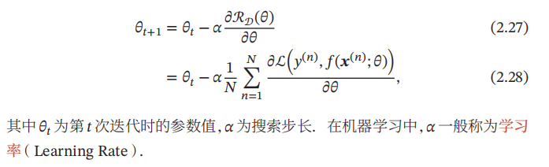
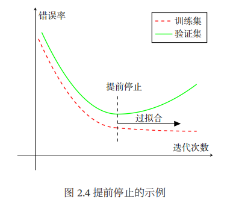

## 一、深度学习  
深度学习解决问题：在有限样例中通过算法总结出一般性的规律，并可以应用到新的未知数据  
## 二、机器学习流程  
原始数据->数据预处理->特征提取->特征转换->预测->结果  
   1. 数据预处理：经过数据的预处理，如去除噪声等. 比如在文本分类中，去除停用词等.  
   2. 特征提取：从原始数据中提取一些有效的特征. 比如在图像分类中，提取边缘、尺度不变特征变换（Scale Invariant Feature Transform，SIFT）特征等.   
   3. 特征转换：对特征进行一定的加工，比如降维和升维. 很多特征转换方法也都是机器学习方法.降维包括特征抽取（Feature Extraction）和特征选择（Feature Selection）两种途径. 
   4. 预测：机器学习的核心部分，学习一个函数进行预测.  
## 三、机器学习概述  
+ 机器学习(Machine Learning)：  
   早期的工程领域，也称为(模式识别 Pattern Recognition)，让计算机从数据中进行自动学习，得到某种知识(或规律)  
+ 特征(Feature)，也可以称为属性  
+ 标签(Label):可以是连续值也可以是离散值  
+ 样本(sample):一个标记好特征和标签的实例  
+ 数据集(Data Set)：一组样本构成的集合  
   + 训练集(Training Set):用于训练模型  
   + 测试集(Test Set):用于检验模型好坏  
+ 特征向量(Feature Vector):一个样本的所有特征构成的向量x=\[x1,x2,x3,...,xD\]T  
+ 独立同分布(Identically and Independently Distributed,IID):独立的从相同数据分布中抽取的。  
+ 学习/训练：给定训练集，让计算机从函数集合中自动寻找最优的函数来近似特征向量x与标签y的真实映射关系。  
## 四、机器学习三要素  
+ 模型  
+ 学习准则：|𝑓(𝒙, 𝜃∗) − 𝑦| < 𝜖, ∀(𝒙, 𝑦) ∈ 𝒳 × 𝒴,  
+ 损失函数：非负实数函数，用来量化模型预测和真实标签之间的差异  
   + 0-1损失函数：虽然0-1损失函数能够客观地评价模型的好坏，但其缺点是数学性质不是很好：不连续且导数为0，难以优化. 因此经常用连续可微的损失函数替代.  
   + 平方损失函数一般不适用于分类问题.  
   + 交叉熵损失函数（Cross-Entropy Loss Function）一般用于分类问题  
   + Hinge损失函数，二分类问题  
## 五、风险最小化原则  
### (1)经验风险(Empirical Risk)  
即在训练集上的平均损失，一个切实可行的学习准则是找到一组参数𝜃∗ 使得经验风险最小  
### (2)过拟合(Overfitting)  
1. 根据大数定理可知，当训练集大小|𝒟|趋向于无穷大时，经验风险就趋向于期望风险. 如何选择训练样本个数可以参考PAC学习理论，参见第 2.8.1 节.然而通常情况下，我们无法获取无限的训练样本，并且训练样本往往是真实数据的一个很小的子集或者包含一定的噪声数据，不能很好地反映全部数据的真实分布. 经验风险最小化原则很容易导致模型在训练集上错误率很低，但是在未知数据上错误率很高  
  
2. 欠拟合（Underfitting），即模型不能很好地拟合训练数据，在训练集的错误率比较高. 欠拟合一般是由于模型能力不足造成的.  
> 过拟合：给定一个假设空间 ℱ，一个假设 𝑓 属于 ℱ，如果存在其
> 他的假设𝑓′ 也属于ℱ,使得在训练集上𝑓 的损失比𝑓′ 小，但在整个样本空间
> 上𝑓′ 比𝑓 的损失小，那么就说假设𝑓 过度拟合训练数据[Mitchell, 1997].  
### (3)正则(Regularization)  
1. 过拟合问题往往是由于训练数据少和噪声以及模型能力强等原因造成的.  
2. 为了解决过拟合问题，一般在经验风险最小化的基础上再引入参数的正则化（Regularization）来限制模型能力，使其不要过度地最小化经验风险. 这种准则就是结构风险最小化（Structure Risk Minimization，SRM）准则  
3. l1范数，l2范数。l1范数通常会使得参数具有一定的稀疏性。  
## 六、最优化(Optimization)  
在确定了训练集 𝒟、假设空间 ℱ 以及学习准则后，如何找到最优的模型
𝑓(𝒙, 𝜃∗) 就成了一个最优化（Optimization）问题. 机器学习的训练过程其实就
是最优化问题的求解过程.  
### (0)参数与超参数  
 在机器学习中，优化又可以分为参数优化和超参数优化. 模型𝑓(𝒙; 𝜃)中的𝜃 称为模型的参数，可以通过优化算法进行学习. 除了可学习的参数𝜃 之外，还有一类参数是用来定义模型结构或优化策略的，这类参数叫做超参数（Hyper-Parameter）.  
### (1)梯度下降法  
+ 批量梯度下降法  
   
+ 随机梯度下降法  
   随机梯度下降法也叫增量梯度下降法。  
   为了减少每次迭代的计算复杂度，我们也可以在每次迭代时只采集一个样本，计算这个样本损失函数的梯度并更新参数，即随机梯度下降法
+ 小批量梯度下降法  
   小批量梯度下降法（Mini-Batch Gradient Descent）是批量梯度下降和随机梯度下降的折中. 每次迭代时，我们随机选取一小部分训练样本来计算梯度并更新参数，这样既可以兼顾随机梯度下降法的优点，也可以提高训练效率. 
### (2)提前停止  
+ 验证集(Validation Set)是模型训练过程中单独留出的样本集，它可以用于*调整模型的超参数*和用于对模型的能力进行初步评估。  
+ 测试集既不参与参数的学习过程，也不参与参数的选择过程，仅仅用于模型评价。  
  

