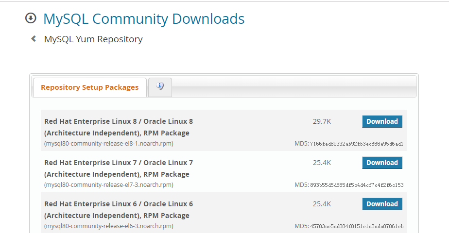

# Mysql数据库 8.0版本安装  
###### 安装环境：CentOS-7 rpm+yum安装 mysql8.0  
### step1.下载并安装镜像  
[官网](https://dev.mysql.com/downloads/repo/yum/)找到相应版本的rpm包下载地址  

使用wget下载：  
`# wget https://dev.mysql.com/get/mysql80-community-release-el7-3.noarch.rpm`  
下载后安装：  
`# rpm -ivh mysql80-community-release-el7-3.noarch.rpm`
### step2.安装mysql服务  
安装前先升级下mysql相关组件：  
`# yum update mysql-server`  
之后便可以安装mysql服务了：  
`# yum install mysql-server`  
### step3.初始化启动条件  
服务器启动需要将mysql文件的属主属组权限给mysql虚拟用户  
`# chown mysql:mysql -R /var/lib/mysql`  
权限设置好后，便可以初始化mysql了  
`# mysqld --initialize --console`  
这里加上`--console`参数，会将mysql的随机生成的初始密码打印出来，方便我们第一次登陆  
`2019-12-04T15:27:58.208042Z 5 [Note] [MY-010454] [Server] A temporary password is generated for root@localhost: 你的初始密码(先记下来)`  
### step4.启动服务并设置开机自启动  
`# systemctl enable mysqld`  
`# systemctl daemon-reload`  
`# systemctl start mysqld`  

Fix：如果启动mysqld服务时报以下错：  
`Job for mysqld.service failed because the control process exited with error code. See "systemctl status mysqld.service" and "journalctl -xe" for details.`  
我们可以通过提示的命令检查错误原因：`"systemctl status mysqld.service`或者`journalctl -xe`  
通常安装时出现该错误是因为文件权限问题，执行命令：`chown mysql:mysql -R /var/lib/mysql`即可修复  
再重新启动服务即可：`service mysqld start`
  
之后查看启动状态：  
`service mysqld start`  
如果启动成功，应该出现以下显示：  
```
● mysqld.service - MySQL Server
   Loaded: loaded (/usr/lib/systemd/system/mysqld.service; enabled; vendor preset: disabled)
   Active: active (running) since Thu 2019-12-05 10:40:35 CST; 25min ago
   ......
```  
### step5.登录数据库并修改密码  
首次登录数据库便需要用到我们step3中得到的初始密码  
登录数据库：  
`mysql -u root -p`  
输入初始密码后回车登陆成功，进入mysql指令界面，再修改你的密码：  
`mysql> ALTER USER 'root'@'localhost' IDENTIFIED BY '新密码';`  
注意：新密码要用引号包起来，而且密码的要求是大小写字母，数字，特殊符号的组合，如果需要改成简单的密码，需要自行设置（网上搜索有很多教程）  
重新登录之后，便算安装成功了。