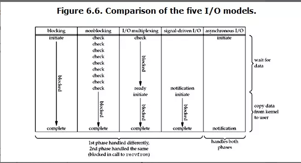
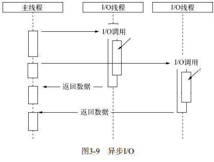
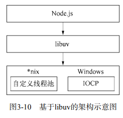
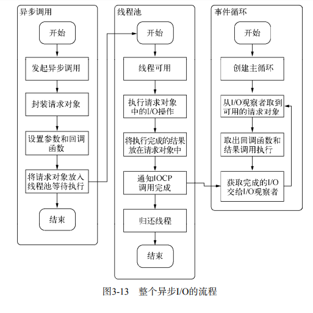

## 一、基础知识
### 1. 两组概念  
同步与异步：  
1. 同步响应时间sum(n1+n2+...)  
2. 异步响应时间max(n1,n2,n3)  
  
多单线程：  
1. 多线程可充分利用多核CPU，但创建线程和执行线程上下文切换代价较大  
2. 单线程符合正常编程顺序，易于表达，但会阻塞。 
> 多工作进程，相当于多占用资源提升响应速度，但对于同一组任务无法分发到多个进程上  
### 2. 异步单线程
Nodejs采用单线程避开死锁，状态同步等问题；采用异步避开阻塞。  
但注意，单线程仅仅是js执行在单线程中罢了，在Node中，内部IO任务都另有线程池
提供类似前端web worker的子进程提高CPU利用效率。  
  
### 3. 轮询  
[参考文章](https://segmentfault.com/a/1190000003063859)  
对操作系统来说异步/同步与阻塞/非阻塞是两种不同的概念  
1. 阻塞IO打开文件描述符后获取到整个数据才返回  
2. 非阻塞IO不带数据直接返回，要获取数组还需要通过文件描述符再次获取。  
   此时返回的并不是业务层想要的数据，程序还需要重复的调用IO操作来确认是否完成，该过程即轮询。  
## 二、Nodejs中的异步IO  
Nodejs实现了基于事件驱动的异步IO机制。  

Nodejs实现的异步方式：  
  
基于libuv实现,libuv封装了线程池  
  
## 三、Nodejs事件流  
1. JS线程产生异步调用，生成请求对象放入线程池，等待执行。  
2. libuv调用内部可用的多线程池执行IO请求对象。  
3. 事件循环。Node进程启动时会开启事件循环，执行一次循环称为一个Tick。每个循环中会有多个观察者，询问这些观察者判断是否有要处理的事件。有则取出事件执行相关回调。  

Nodejs整个IO流过程  
  
## 四、非IO的异步API  
1. setTimeout和setInterval。实现原理与异步IO类似，但不需要线程池参与。  
   创建的定时器会被插入到定时器观察者内部的红黑树中。每次tick会取出检查是否超过定时时间，超过则形成一个事件，立即执行回调函数。  
   > 注意。尽管事件循环非常快，但仍不能保证按时执行。  
2. process.nextTick  
    属于idle观察者。  
    相比计时器（O(lg(n))）更轻量O(1)。计时器操作了红黑树。  
    只会将回调函数放入队列中，下一轮Tick取出执行。  
    回调函数保存在数组中。  
3. setImmediate  
   与nextTick十分类似，都是将回调函数延迟执行。属于check观察者。差别在于：  
   （1）nextTick优先级高(idle观察者先于check观察者)  
   （2）nextTick回调函数保存在数组中，它保存在链表中  
   （3）nextTick每轮循环会将数组中所有回调函数执行完，它每轮循环执行链表的第一个回调函数。  
例题：  
```  
process.nextTick(function () {
 console.log('1');
});

process.nextTick(function () {
 console.log('2');
});

setImmediate(function () {
 console.log('3');
 // 进入下个Tick
 process.nextTick(function () {
    console.log('强势插入');
 });
});

setImmediate(function () {
 console.log('4');
});

console.log('5');

stdout:
5
1
2
3
强势插入
4
 
```