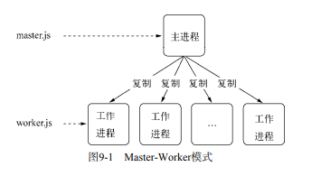
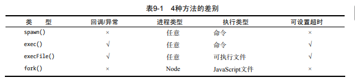
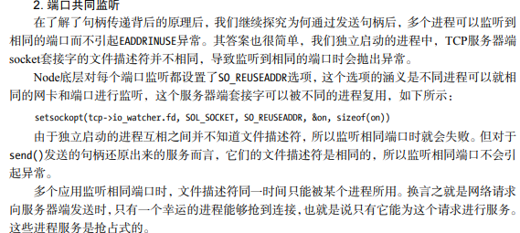
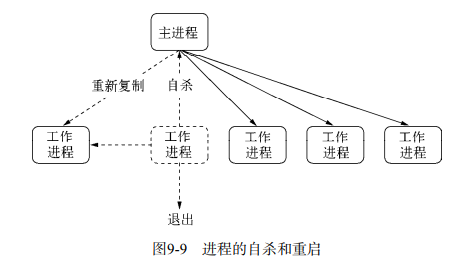

## 一、存在的问题  
1. 如何充分利用多核CPU？  
2. 如何保证单线程下的健壮性(单线一旦异常没有捕获直接炸)？  
## 二.this history  
1. 同步服务：1次解决1请求  
2. 复制进程：复制多个进程处理多个请求。  
   缺点：代价昂贵，相同的状态需要保存多份，启动慢。  
3. 多线程：多个线程，线程间共享数据  
   缺点：线程过多时大量耗费资源在现成的上下文切换中。  
4. 事件驱动  
## 三、多进程架构(child_process)  
Mater-Worker模式，即主进程-工作进程的主从模式。主进程负责调度和管理工作进程，趋于稳定。工作进程负责处理具体的业务，稳定性需要开发者关注。  
> 注意：这里启动多个进程只是为了充分利用多核CPU，但fork()进程是昂贵的，并不是用来解决高并发问题  
  
  
### （1）创建子进程  
```  
const cp = require('child_process');

cp.spawn('node', ['worker.js']);
cp.exec('node worker.js', function (err, stdout, stderr) { });
cp.execFile('worker.js', function (err, stdout, stderr) {});
cp.fork('./worker.js'); 

// 注意：如果js文件通过execFile()运行，它的首行内容必须添加：#!/usr/bin/env node 
```  
  
### （2）进程间通信  
消息机制，而不是共享或直接操作相关资源。  
```  
send:进程发消息  
onmessage：进程接受消息
```  
#### IPC ( Inter-Process Communication 进程间通信 )  
IPC抽象层，具体由libuv提供。类似socket，双向通信，在系统内核中完成通信，非常高效。父进程创建子进程之前会创建IPC管道并监听它，创建node子进程后会通过环境变量（NODE_CHANEL_FD）告诉子进程这个IPC的文件描述符，子进程启动时找到它并完成链接  
  
父进程与子进程运行在不同端口（相同端口不能重复占用），可通过代理分发请求，但接受链接和代理分发给工作进程需要用掉两个文件描述符，影响了系统的扩展能力。后来引入了发送句柄的功能，send可以传输句柄。  
> 支持的句柄：  
>1. net.Socket/Server/Native TCP套接字或 服务器或 C++层面的TCP套接字  
>2. dgram.Socket/Native (C++)UDP套接字
```  
// 示例：直接将TCP服务器发给了子进程
// 主进程
var child = require('child_process').fork('child.js');
// Open up the server object and send the handle
var server = require('net').createServer();
server.on('connection', function (socket) {
 socket.end('handled by parent\n');
});
server.listen(1337, function () {
 child.send('server', server);
});

// 子进程
process.on('message', function (m, server) {
 if (m === 'server') {
 server.on('connection', function (socket) {
 socket.end('handled by child\n');
 });
 }
}); 
```  
  
### （3）优化  
1. 自杀前先通知主进程新建进程，实现平滑重启，提高健壮性。不能等到进程exit了再重建新的进程(部分请求会丢失)  
     
2. 限制重启次数，检测程序编写错误。  
3. 
## 四、cluster封装  

## 五、[真正的多线程=>走你！](2.md)