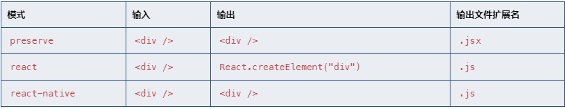

# 一、使用步骤  
1. 给文件一个.tsx扩展名
2. 启用jsx选项  
   配置`tsconfig.json`中的`jsx`.  
   preserve模式下生成代码中会保留JSX以供后续的转换操作使用（比如：Babel）同时输出文件会带有.jsx扩展名  
   react模式会生成React.createElement，在使用前不需要再进行转换操作了，输出文件的扩展名为.js  
   react-native相当于preserve，它也保留了所有的JSX，但是输出文件的扩展名是.js。
     
# 二、注意事项  
## 1. 断言  
因为尖括号在jsx（标签）和ts（断言）冲突，tsx中使用as进行断言。  
## 2. 类型检查  
```  
1. 对于React，固有元素会生成字符串（React.createElement("div")），
   然而由你自定义的组件却不会生成（React.createElement(MyComponent)）  

2. 传入JSX元素里的属性类型的查找方式不同。 固有元素属性本身就支持，然而自定义
   的组件会自己去指定它们具有哪个属性。
```  
固有元素总是以一个小写字母开头，基于值的元素总是以一个大写字母开头。  
### （1）固有元素  
固有元素使用特殊的接口JSX.IntrinsicElements来查找。 默认地，如果这个接口没有指定，会全部通过，不对固有元素进行类型检查。 然而，如果这个接口存在，那么固有元素的名字需要在JSX.IntrinsicElements接口的属性里查找。  
```  
declare namespace JSX {
    interface IntrinsicElements {
        foo: any
    }
}

<foo />; // 正确
<bar />; // 错误
```  
### （2）基于值的元素  
基于值的元素（无状态或者类组件）会简单的在它所在的作用域里按标识符查找。  
1. 无状态组件：当做JavaScript函数处理。可以函数重载！但ts会强制返回值可以赋值给JSX.element，即类型可以声明为JSX.Element  
    ```  
    function MainButton(prop: SideProps): JSX.Element {
        ...
    }
    ```  
2. 