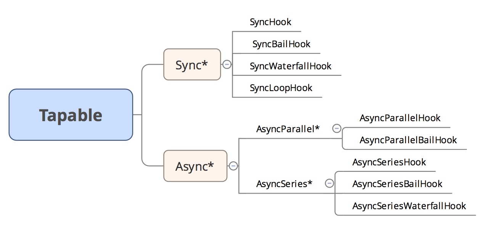

## 一、同步/异步钩子
  
## 二、同步钩子  
类似事件监听机制(事件没有名字，而是按顺序全部调用)。钩子类内部含数组保存tap方法注册的事件函数，call方法触发事件函数。  
```  
let {SyncHook} = require('tapable')

class Demo {
    constructor(){
        this.hooks = {
            say:new SyncHook(['name'])
        }
    }
    tap(){
        this.hooks.say.tap('node1',function (name) {
            console.log('node1:',name)
        })
        this.hooks.say.tap('node2',function (name) {
            console.log('node2:',name)
        })
    }
    start(){
        this.hooks.say.call("Have a guess!")
    }
}

let a = new Demo()
a.tap()
a.start()
**************************
node1: Have a guess!
node2: Have a guess!

```
### 1. SyncHook  
钩子类含数组，tap注册事件回调，call按顺序全部调用  
### 2. SyncBailHook  
tap注册，call按顺序调用，当前事件函数返回非undefined时，中断跳出，不去执行后面的。  
### 3. SyncWaterFallHook  
tap注册，call按顺序调用，事件的返回结果会传递给下个事件函数作为参数。  
### 4. SyncLoopHook  
遇到某个返回非undefined的事件函数会循环调用直到返回undefined为止。  
## 三、异步钩子  
1. tap注册同步事件，tapAsync(cb)注册异步事件和回调函数，tapPromise(注册的是promise)；  
2. call，callAsync，callPromise  
```  
let {AsyncParallelHook} = require('tapable')

class Demo {
    constructor(){
        this.hooks = {
            say:new AsyncParallelHook(['name'])
        }
    }
    tap(){
        this.hooks.say.tapPromise('node1',function (name) {
            return new Promise((res,rej)=>{
                setTimeout(()=>{
                    console.log(1)
                    res()
                },1000)
            })
        })
        this.hooks.say.tapPromise('node2',function (name) {
            return new Promise((res,rej)=>{
                setTimeout(()=>{
                    console.log(2)
                    res()
                },1000)
            })
        })
    }
    start(){
        // 类似promise.all
        this.hooks.say.promise("Have a guess!").then(()=>{
            console.log("End")
        })
    }
}

let a = new Demo()
a.tap()
a.start()
```
### 并行  
#### （1）AsyncParallelHook
#### （2）AsyncParallelBailHOOk  
### 并行  
