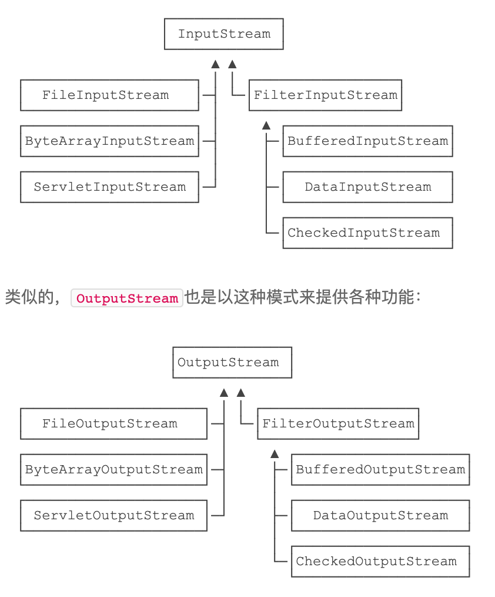

## 字节流  
以byte为单位，分为输入输出：inputStream，outputStream  
1. 输入流  
      
    ```  
    int  read()             从输入流读入一个 8 字节的数据，将它转换成一个 0~ 255 的整数，返回一个整数，如果遇到输入流的结尾返回 -1
    int  read(byte[] b)     缓存，从输入流读取若干字节的数据保存到参数 b 指定的字节数组中，返回的字节数表示读取的字节数，如果遇到输入流的结尾返回 -1
    int  read(byte[] b,int off,int len)     从输入流读取若干字节的数据保存到参数 b 指定的字节数组中，其中 off 是指在数组中开始保存数据位置的起始下标，len 是指读取字节的位数。返回的是实际读取的字节数，如果遇到输入流的结尾则返回 -1
    void close()            关闭数据流，当完成对数据流的操作之后需要关闭数据流
    int  available()        返回可以从数据源读取的数据流的位数。
    skip (long n)           从输入流跳过参数 n 指定的字节数目
    boolean markSupported() 判断输入流是否可以重复读取，如果可以就返回 true
    void mark(int readLimit)如果输入流可以被重复读取，从流的当前位置开始设置标记，readLimit 指定可以设置标记的字节数
    void reset()            使输入流重新定位到刚才被标记的位置，这样可以重新读取标记过的数据  
    ```  
    read()方法调用是同步的，阻塞的，借助byte数组缓存优化  
2. 输出流  
```  
1. void write(int c)          向输出流中写入一个字符（int最低8位对应的字符）
2. void write(char[] cbuf)     把参数 cbuf 指定的字符数组中的所有字符写到输出流中
3. void write(char[] cbuf,int off,int len)     把参数 cbuf 指定的字符数组中的若干字符写到输出流中。其中，off 指定字符数组中的起始下标，len 表示元素个数
4. void write(String str)      向输出流中写入一个字符串
5. void write(String str,int off,int len)
      向输出流中写入一个字符串中的部分字符。其中，off 指定字符串中的起始偏移量，len 表示字符个数
6. append(char c)              将参数 c 指定的字符添加到输出流中
7. append(charSequence esq)    将参数 esq 指定的字符序列添加到输出流中
8. append(charSequence esq,int start,int end)
      将参数 esq 指定的字符序列的子序列添加到输出流中。其中，start 指定
      子序列的第一个字符的索引，end 指定子序列中最后一个字符后面的字符
      的索引，也就是说子序列的内容包含 start 索引处的字符，但不包括 end索引处的字符  
```
write方法会在缓冲区满了会自动调用flush()将缓冲区内容取出发送  
flush()手动调用提前发送  
## 字符流  
Reader、Writer，以char为单位  
1. FileReader.read()返回对应char的int  
2. 利用BufferedReader的readLine()直接读取一行  
   ```
   fr = new FileReader("D:\\myJava\\book.txt"); // 创建 FileReader 对象
   br = new BufferedReader(fr); // 创建 BufferedReader 对象  
   ```  
## Filter模式（装饰器）  
需要给一个“基础”InputStream附加各种功能时，先确定这个能提供数据源的InputStream(左边)，再叠加各种“附加”功能组件的模式，称之为Filter模式（或者装饰器模式：Decorator）
  
## 压缩/解压缩  
GZIP和GZStream