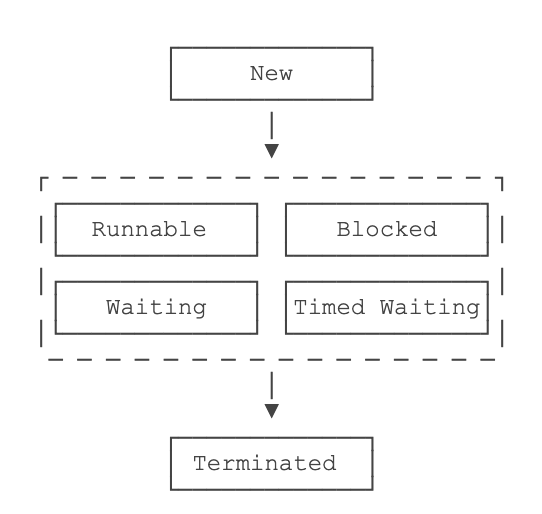

## 一、基本使用  
Thread类，线程执行代码在run方法里，start自动调用实例中的run方法，sleep休眠，thread.join等待该线程执行结束  
线程状态：  
  
## 二、终端进程
1. interrupt()向线程发送中断请求，但不一定（立马）响应，目标线程通过检测isInterrupted（）标志来判断  
   如果调用时线程处于等待状态，会捕获到错误（InterruptedException）
2. volatile标志可实现线程共享变量  
   ~~~  
   因此，volatile关键字的目的是告诉虚拟机：
   1. 每次访问变量时，总是获取主内存的最新值；
   2. 每次修改变量后，立刻回写到主内存。
   ~~~  
## 三、守护进程  
在JVM中，所有非守护线程都执行完毕后，无论有没有守护线程，虚拟机都会自动退出。  
### 1. 创建守护进程  
创建守护线程：在调用start()方法前，调用setDaemon(true)把该线程标记为守护线程：  
```  
Thread t = new MyThread();
t.setDaemon(true);
t.start();
```  

