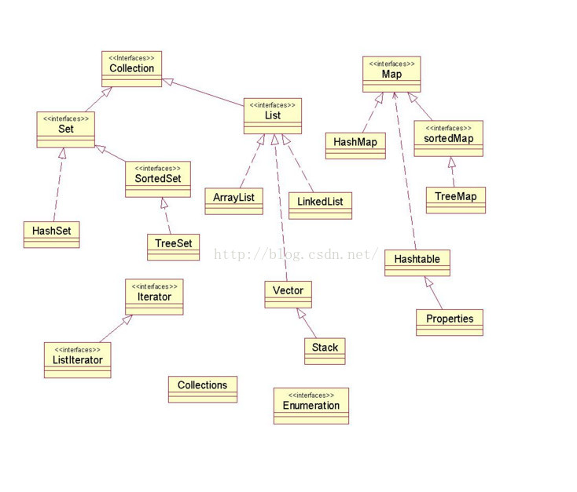

# 容器  

## Collection  
collection主要方法:
~~~  
boolean add(Object o)添加对象到集合
boolean remove(Object o)删除指定的对象
int size()返回当前集合中元素的数量
boolean contains(Object o)查找集合中是否有指定的对象
boolean isEmpty()判断集合是否为空
Iterator iterator()返回一个迭代器
boolean containsAll(Collection c)查找集合中是否有集合c中的元素
boolean addAll(Collection c)将集合c中所有的元素添加给该集合
void clear()删除集合中所有元素
void removeAll(Collection c)从集合中删除c集合中也有的元素
boolean retainAll(Collection c)两个集合交集的元素给原集合，并判断原集合是否改变，改变则true，不变则false
~~~  
1. 集合当中只能放置对象的引用，无法放置原生数据类型，我们必须使用原生数据的包装类才能加入到集合当中
2. 集合当中都是Object类型，因此取出来的也是Object类型，那么必须要使用强制类型转化将其转换成真正的类型（放置进去的类型）  
## 概述  
List、Set、Map是这个集合体系中最主要的三个接口。
1. 其中List和Set继承自Collection接口。  
   1. Set不允许元素重复。HashSet和TreeSet是两个主要的实现类。  
   2. List有序且允许元素重复。ArrayList、LinkedList和Vector是三个主要的实现类。  
   ~~~  
   i. ArrayList:
     1. 底层数据结构是数组，查询快、增删慢
     2. 线程不安全，效率高
    ii. Vector：
     1. 底层数据结构是数组，查询快，增删慢
     2. 线程安全，效率底
    iii. LinkedList：
     1. 底层数据结构是链表，查询慢，增删快
     2. 线程不安全，效率高
   ~~~  
2. Map也属于集合系统，Map是key对value的映射集合。  
   1. HashMap、TreeMap和Hashtable是三个主要的实现类。  
   2. SortedSet和SortedMap接口对元素按指定规则排序，SortedMap是对key列进行排序。  
## LinkedList  
链表实现，插入和删除效率高  
~~~  
a) 添加功能
 i. public void addFirst(Object e)
 ii. public void addLast(Object e)
b) 获取功能
 i. public Object getFirst()
 ii. public Object getLast()
c) 删除功能
 i. public Object removeFirst()
 ii. public Object removeLast()
~~~  
## Vector  
~~~  
a) 添加功能
 i. public void addElement(Object obj)
b) 获取功能
 i. public Object elementAt(int index)
 ii. public Enumeration elements ()
  1. 也是用来遍历集合
  2. boolean hasMoreElements()
  3. Object nextElement()
  4. 基本不用这个，都是直接用上面的迭代器实现遍历
~~~
## 使用  
~~~
a) 是否元素唯一
 i. 是：Set
  1. 是否排序
   a) 是：TreeSet
   b) 否：HashSet
  如果不知道用哪个Set就用HashSet
 ii. 否：List
  1. 是否对安全性有要求
   a) 是：Vector
   b) 否：
     查询多：ArrayList
     增删多：LinkedList
  如果不知道用哪个List用ArrayList
如果知道是用集合但不知道用哪个用ArrayList
~~~