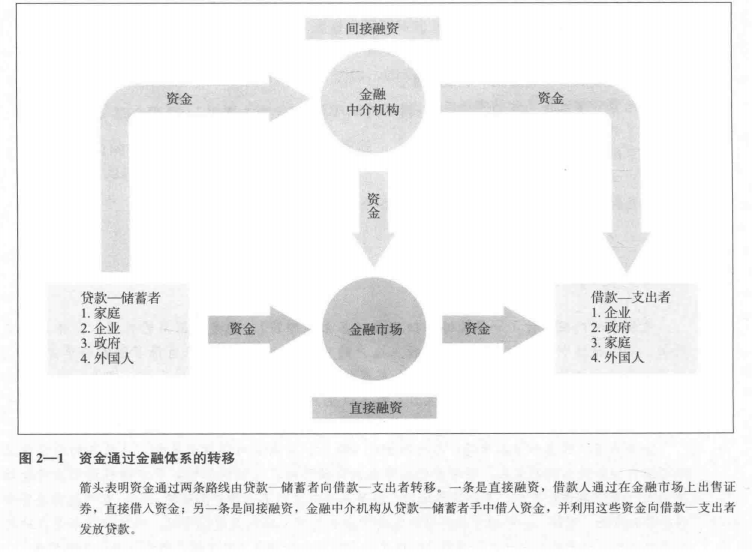

## 一、金融市场的功能  
最基本的功能：资金转移,将资金从拥有储蓄的人手里转移到资金短缺的人手里。  
  
资本(capital,可以用来创造财富的财富)的合理配置，可以提高效率，改善每个人的经济福利。  
  
## 二、金融市场的结构  
### 1. 债务与股权市场  
企业或者个人获取资金的两种方式：  
1. 发行债券或抵押票据。  
   根据债务工具的期限(maturity)可分为：  
   + 短期：1年以下  
   + 中期：1~10年  
   + 长期：10年以上  
2. 发行普通股等股权(equity)  
   + 通常股权工具所有者可以享受股利(dividend)，无到期日，视为长期证券  
### 2. 一级与二级市场  
+ 一级市场(primary market)  
   筹资机构将其新发行的股票与证券销售给最初购买者的金融市场  
   ~~~  
   一级市场并不为公众熟悉，因为销售给最初购买者并不是公开进行的。  
   投资银行(investment bank)是一级市场上协助首次出售的重要金融机构，方式为证券承销。
   证券承销(underwriting),确保公司证券能按照某一价格销售出去，之后再向公众推销这些证券。  
   ~~~  
+ 二级市场(secondary market)  
   交易已经发行的证券的金融市场  
   ~~~  
   证券经纪人(broker):投资者的代理人，负责匹配证券的买方和卖方。  
   交易商(dealer):按照报价买卖证券，链接买卖方。
   交易所(excahnge):证券的买卖双方集中进行交易的场所。  
   场外市场(OTC, over-the-counter market):通过大量分散的像投资银行等证券经营机构的证券柜台和主要电讯设施买卖证券而形成的市场。主要为国债。
   ~~~  
   企业只有在一级市场首次发行时才能获取资金，但二级市场对一级市场其重要作用：  
     1. 增强流动性(liquidity)，金融工具的流动性提高增强了在金融市场上的接受度，使得在一级市场上的销售变得更加容易。  
     2. 二级市场决定了发行企业在一级市场上的销售价格，一级市场的价格不会高于二级市场的预期    
## 三、 金融市场工具  
货币市场(money market):交易短期债务工具的金融市场(通常为1年以下)  

资本市场(capital market):交易长期债务工具与股权工具的金融市场(通常为1年或1年以上)  
### 1. 货币市场工具  
1. 美国国库券(United States Treasure Bills)  
   短期分为1，3，6月。无利息，但初始价格低于到期日所支付的固定金额。违约(default)风险很低。  
2. 可转让存单(negotiable bank certificates of deposit)  
   存单(certificates of deposit,CD)银行向储户发行的债务工具，据此每年支付利息，并在到期日偿还*初始购买的价格*  
   可转让存单是在二级市场上出手的存单，持有人通常是企业，货币市场基金，信托机构和政府机构。  
3. 商业票据(commercial paper)  
   大企业或者大银行发售的短期债务工具  
4. 回购协议(repurchase agreements)  
   短期贷款，期限通常为两周之内。以买入国库券为担保，如果借款人不偿清贷款，国库券作为抵押品归贷款人所有。  
5. 联邦基金(federal fund)  
   联邦基金（Fed Funds）指美国的商业银行存放在联邦储备银行（即中央银行体系）的准备金，包括法定准备金及超过准备金要求的资金。这些资金可以借给其他成员银行，以满足他们对短期准备金的需求，拆借的利率称为联邦基金利率。该利率是美国两大基准利率之一，另一基准利率是贴现率。
   ~~~
   准备金（reserve）是商业银行库存的现金按比例存放在中央银行的存
   款。实行准备金的目的是确保商业银行在遇到突然大量提取银行存款时，
   能有相当充足的清偿能力。自20世纪30年代以后，法定准备金制度还成
   为国家调节经济的重要手段，是中央银行对商业银行的信贷规模进行控制
   的一种制度。中央银行控制的商业银行的准备金的多少和准备率的高低影
   响着银行的信贷规模。这个制度规定，商业银行不能将吸收的存款全部贷
   放出去，必须按一定的比例，或以存款形式存放在中央银行，或以库存现
   金形式自己保持。准备金占存款总额的比重，称为准备率。
   
   联邦基金市场是由电话网络将市场参与者联结起来的松散的无形市场。
   市场主角是商业银行和其他金融机构。联邦基金经纪人在市场中起穿针
   引线作用，向市场参加者提供服务。
   
   联邦基金利率每天都不同，决定于货币市场情况，它对金融市场最敏感，
   当中央银行政策有任何变动时，立刻影响到这种利率的升降，借此可以
   预测中央银行政策的趋向，能合理反映货币市场松紧程度。  
   ~~~
[利率信息查询网址](http://www.banktate.com)：优惠利率(prime rate),联邦基金利率,国库券利率(Treasury bill rate),伦敦银行间同业拆借率(Libor rate)  
### 2. 资本市场工具  
资本市场工具价格的波动性远大于货币市场工具，因而投资风险较高。  
1. 股票  
2. 抵押贷款(mortgages)：向家庭或企业发放的购置房屋，土地或者其它建筑物的贷款，该物为抵押品。  
   抵押支持证券(Mortgage-Backed Security)  
3. 企业债券：该类长期债权由信用评级非常高的企业发行。  
4. 美国政府债券  
5. 消费者贷款和银行商业贷款
## 四、国际金融市场
+ 外国证券(foreign bonds)：国外发行并以发行国货币计价的债券。  
+ 欧洲证券(Eurobond):外国市场发行，但并非以本国的货币计价(如美元)  
+ 欧洲货币(Eurocurrencies):存放在发行国之外的银行的货币。如欧洲美元(Eurodollar)即存储在美国以外国家银行的美元，因为这些短期存款同样可以赚取利息，可视为短期债券。  
### 国外股票市场指数  
1. 道琼斯工业平均指数（DJIA）：道琼斯公司编制，是美国最大三十家上市公司的指数  
2. 标注普尔500指数：美国500家  
3. 纳斯达克综合指数：在纳斯达克股票市场上交易的所有股票的指数。美国大部分科技股都在这个市场上交易。  
4. 伦敦金融时报100指数（FTSE100）：在伦敦证券交易所交易，资本最为雄厚的100家英国公司。  
5. 恒生指数（Hang Seng）:在中国香港股票交易所交易的大公司的指数。  
6. 其他：海峡时报指数（新加坡）,法兰克福DAX指数，巴黎CAC40指数。  
