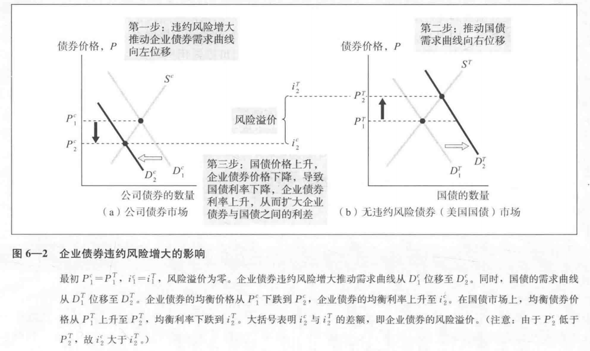
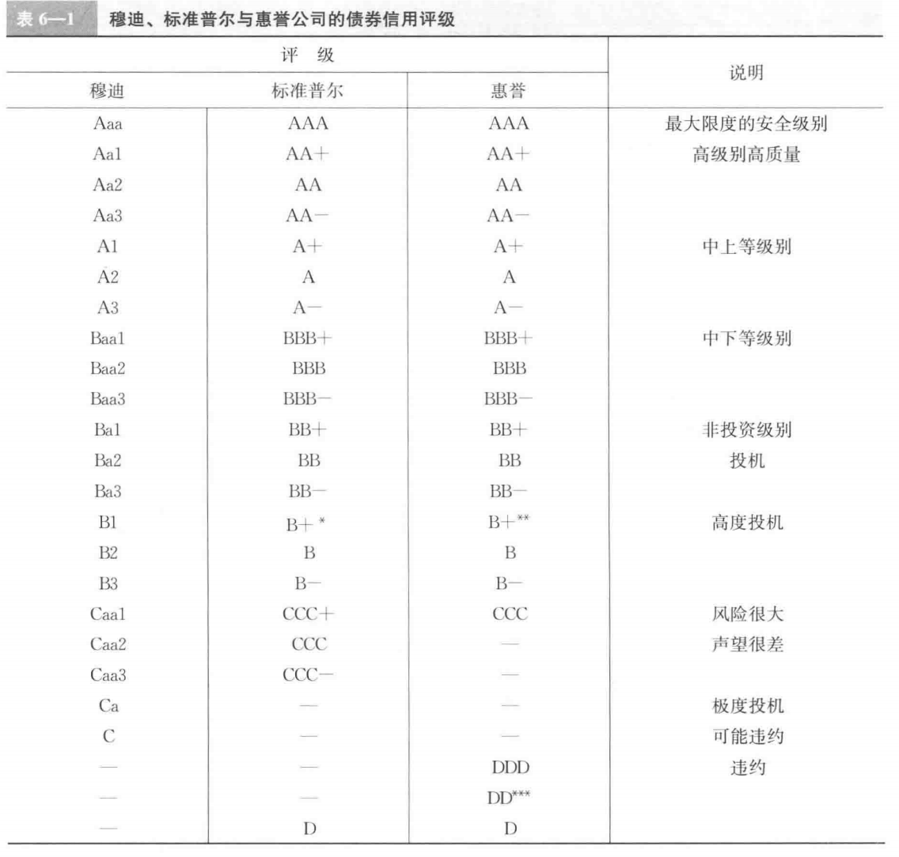
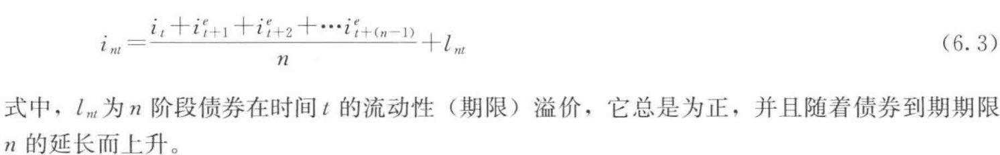
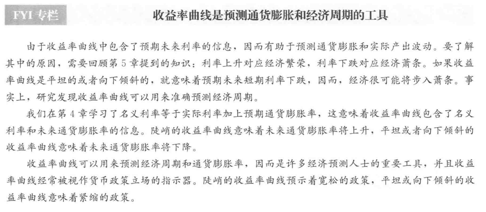

## 一、利率的风险结构  
风险、流动性、税  
### 1. 违约风险  
1. 风险溢价：持有无违约风险和由违约风险债券之间的利差  
当债券的违约风险增加时，同时会降低风险债券的需求和提升国债的需求  
风险溢价 = 国债风险溢价+违约风险溢价  
  
具有违约风险的债券风险溢价总为正，且风险溢价随着违约风险的上升而增加
2. 信用评级  
信用评级机构一方面对金融产品评级，另一方面对客户提出投资建议。意味着这些机构并没有足够的东西确保评级真实性。
  
### 2. 流动性  
流动性越好越受欢迎。因此国债的利率较低，其流动性高，认可度高
### 3. 所得税  
## 二、利率的期限结构  
用于预测短期利率的走势。  
收益率曲线：将期限不同，但风险结构相同的债券的 收益率连成一条曲线。  
### 1. "预期理论"  
假设：客户如果对n阶段债券和n个1阶段债券同等偏好，即不同期限的债券是完全替代品。那么  
=>  
n阶段利率=所有当期1阶段预期利率的平均水平  
### 2.分割市场理论  
假设：期限不同的债券无法相互替代。  
### 3."流动性溢价理论"  
假定：可以替代，但并非完全替代品  
长期债权的利率 = 预期短期平均利率的平均值+债券供求关系变化的流动性溢价  
  
解释了下列事实：  
1. 随着时间的推移，到期期限不同的债券利率表现出同向的趋势  
2. 如果短期利率较低，收益率曲线很可能时陡峭的向上倾斜  
3. 通常收益率向上倾斜，但如果短期利率较高，很可能会翻转  

