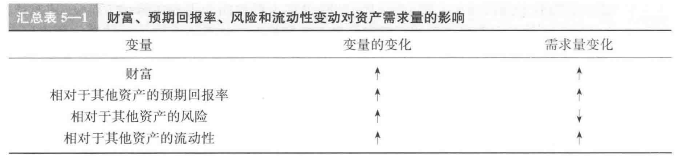
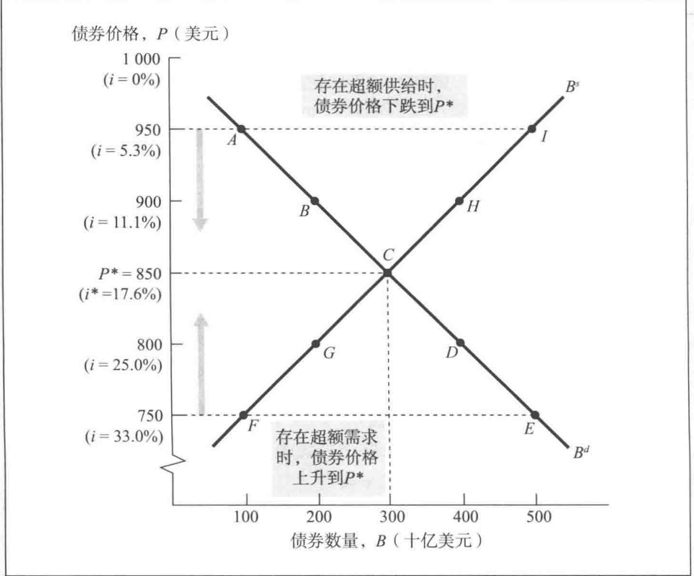
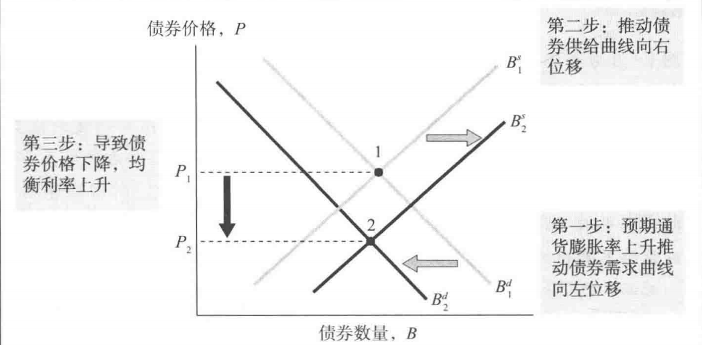
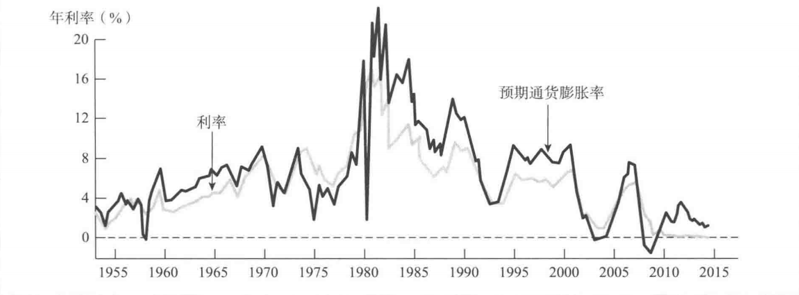
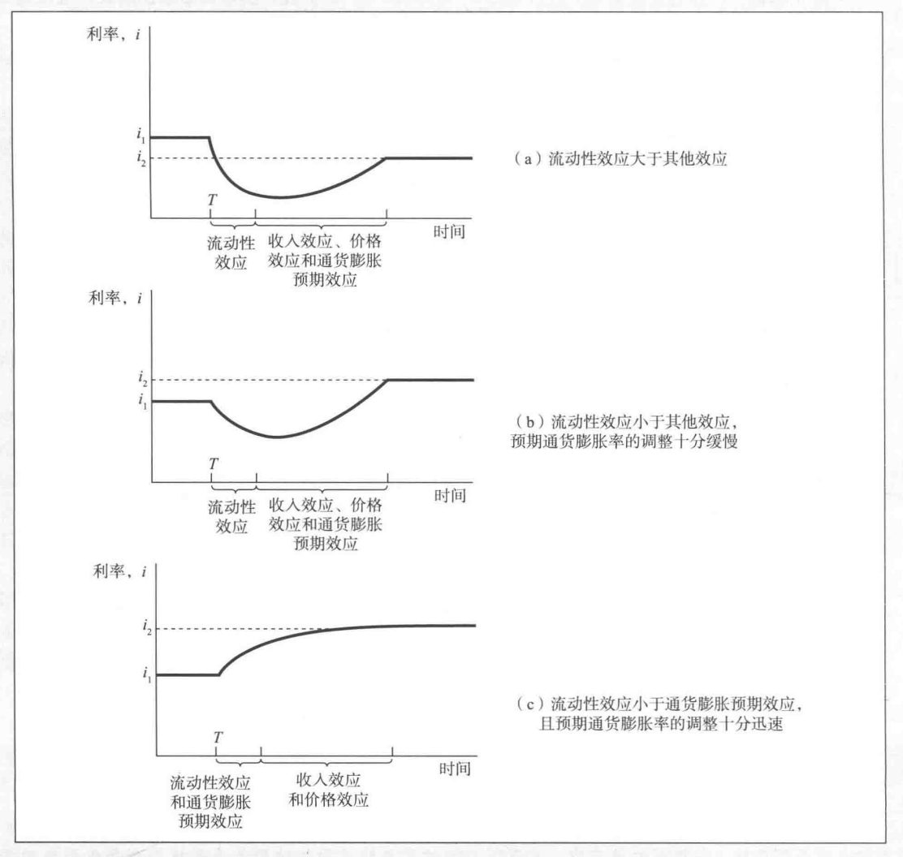

## 一、资产需求的决定因素  
以下四种情况分析，均假定其他情况不变。
1. 财富(wealth)  
   财富的增长会增加对资产的需求  
2. 预期回报率（expect return）  
   资产相对于"其替代性资产"的预期回报率上升，引起需求增加  
3. 风险（risk）  
   相对其他替代性资产的风险上升，引起需求下降  
4. 流动性（liquidity）  
   流动性越强，越受青睐，越大需求  
   
投资组合理论  
  
## 二、货币市场供给与需求  
### 1. 供给曲线  
给定1年期贴现面值1000元的债券，随着债券出售价格的变化，供需曲线的变化如图：  
Bs(supply curve)  
Bd(demand curve)  
  
### 2. 市场均衡  
债券市场上，当Bd=Bc时，达到市场均衡  
### 3. 费雪效应  
通货膨胀率上升，导致利率上升  
  
  
### 4. 流动性偏好理论  
凯恩斯提出。认为经济体总量即债券加货币，分析供需曲线从货币方面入手而不是债券。  
均衡时：Bs+Ms = Bd+Md  
=> Ms-Md = Bd-Bs  
当货币市场均衡时，债券市场也均衡。  
  
流动性效应：增加货币供给量导致利率下降   
货币供给增加导致的  
收入效应：利率随收入水平的提高而提高  
价格效应：利率随价格水平的提高而提高  
通货膨胀预期效益：利率随预期通货膨胀水平的提高而提高  
  
通过提高货币供给的速度来降低利率的理由并不充分  
