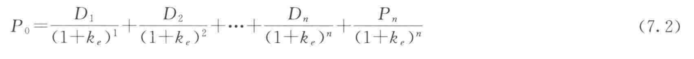
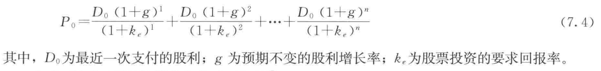
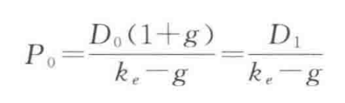

## 一、股票的估值模型  
### 1. 推广的股利估值模型  
  
其中Dn为第n期末支付的股利，Pn为第n期股票的价格，kn为预期投资回报率  
### 2. 戈登增长模型  
许多公司每年按照不变的比率增长股利  
  
> 基于假定：  
> 1. 股利永远按照不变的比率增长。（事实上股利只要在较长的时期内按照不变的比率增长）  
> 2. 假定股利增长率g低于股票投资的要求回报率k  
> 模型可简化为：  
> 
## 二、市场决定股票价格  
1. 更全面的信息能够通过降低其风险而提高其价值  
2. 价格由愿意支付最高价格买主决定，最终价格一定不等于资产的最高价格，但必然高于其他买主愿意支付的价格。  
## 三、有效市场假说  
理性预期理论：预期应该与利用所有信息做出的最优预测（optional forecast）相一致，但这一预测并不完全精确。  
  
有效市场假说即金融领域的平行理性预期理论。  
  
金融市场的现价水平，应使依信息对证券回报率所做的最优预测 = 证券的均衡回报率  
> 即：金融市场中，证券价格反映了所有可得信息。  
### 1. 假说内容  
1. 在"有效市场"中，所有未被利用的盈利机会都会被消除。  
2. 不要求每一个人都熟知信息，只要有一部分人知道信息，在其追逐利益的过程中，市场盈利机会就会被消除（即套利：arbitrage）。  
3. 无论何种目的，股票价格的未来变动都是无法预测的。  
### 2. 应用  
1. 认清现状，把握时间！  
   有效市场假说认为，小道消息、投资分析师发布的消息都是基于公开可得的信息（真正的内部消息换做我也不会告诉你，嘿嘿）
   ，因此如果投资者不具备比其他市场参与者更好的信息，就不可能超越市场。  
2. 只有新的违背市场预期的消息才会引起股票波动  
3. 药方："投资并持有"  
### 3. 有效市场假说并不意味着金融市场是有效的！  
市场基本面（market fundamentals）：直接影响证券未来收入流的事项  
泡沫：资产价格上升的幅度远超其基础价值  
## 四、行为金融  
新兴的研究领域，结合损失厌恶、过分自信和社会传染等社会心理知识进行分析。  
  

    

  