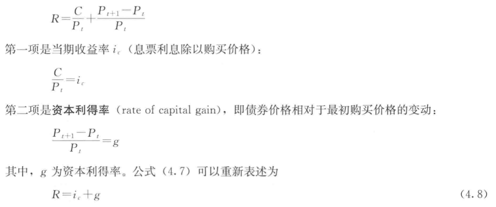
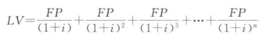

## 一、利率与回报率  
1. 利率:货币的价格  
    现值(present value):PV  
    贴现：未来收入转化为现值  
    未来现金：CF  
    PV=CF/(1+i)^^n
2. 名义利率i = 实际利率r + 通货膨胀率π
2. 回报率  
   
## 二、信用市场工具  
1. 普通贷款  
2. 固定支付贷款（fixed-payment loan也成为分期支付贷款）  
3. 息票债券（coupon bond）。到期之前每年支付息票利息，到期支付债券面值。联邦政府发放的中长期国债和企业债券属于这类。  
4. 贴现发行债券（discount bond,零息债券）。无利息，以低于面值的价格买入，到期支付面值  
### 到期收益率  
1. 普通贷款：收益率就是单利率  
2. 固定支付贷款：  
   
   LV:贷款金额  
   i:利率  
   FP：每年要支付的金额  
3. 息票债券同2，不过最后一次FP替换为债券面值  
4. 贴现发行债券类似普通贷款
利率上升，意味着储蓄的价值提高，也意味着资本流失，债券价格下降    
持有期限与到期期限一样的债券回报率才会与到期收益率相等。到期长于持有期存在利率风险，利率变动会导致资本利得或损失。  
