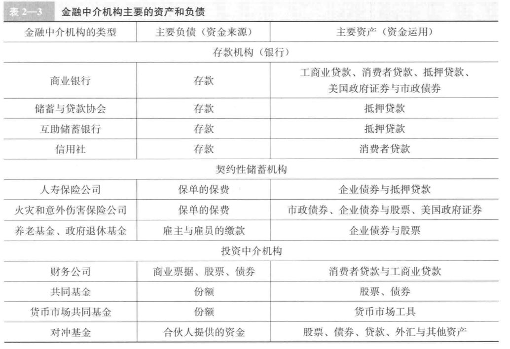

## 一￿. 金融中介  
金融中介主要起间接融资的作用。如银行（中介）向公众借款（储蓄），再向企业发放贷款  
> 在所有国家，金融中介作用均大于证券市场，企业寻求资金来源时通常都会求助金融中介而非证券市场。  
  
金融中介因其以下优势而存在  
1. 降低交易成本  
人们进行金融活动通常需要耗费额外的交易成本(如雇佣律师签合同等)，当成本过高会取消交易。  
金融机构享受规模经济的效益，大大降低了交易成本  
2. 风险分担  
金融中介设计和提供的资产品种风险在投资者承受范围之内，利用销售这些低风险低成本的资产去购买风险更大收益更高的资产，赚取差价利润。  
同时多样化与资产组合也能降低总体风险至单个风险以下。
3. 解决信息不对称  
交易之前：存在逆向选择（adverse selection）=>即风险更大的投资者更迫切拿到资金而想尽办法去获取资金。  
交易之后：道德风险（moral hazard）=>借款人欺骗贷款人从事不真实或者不利于借款人的活动。  
金融中介甄别信息的能力非常高，能有效降低信息风险，在赚取利润的同时为储蓄-贷款者提供大量服务。
4. 范围经济和利益冲突  
中介的一种信息来源可以用于衡量多种金融活动，从而降低信息成本。  
当发生利益冲突时，金融机构也需要承担相应潜在的风险。  
## 二. 金融中介的种类  
  
### （1） 存款机构  
1. 商业银行（commercial banks）  
   通过发行支票存款、储蓄存款与定期存款筹资。  
   发放工商业贷款、消费者贷款和抵押贷款  
2. 储蓄与贷款协会（saving and loan association）  
3. 信用社（credit unions）  
   由一些特定群体（如工会成员、公司雇员）组织的小型合作性贷款机构。主要通过发行被称为股份的存款来获取资金，主要用于发放消费者贷款。  
### （2） 契约型储蓄机构  
基于契约取得资金，基于风险评估，不用担心资金减少，一般筹资用于投资企业债券等  
1. 人寿保险 
2. 意外保险
3. 养老基金与政府退休基金  
### （3） 投资中介机构  
1. 财务公司  
   筹资：销售商业票据、发行股票或债券。
   放贷：小型企业以及消费者
2. 共同基金（mutual funds）  
   筹资：向多人销售份额。  
   投资：购买多样化的股票债券
3. 货币市场共同基金（money market mutual funds）  
   与共同基金类似，但一个重要特征是，持有者可以根据份额价值签发发票，类储蓄性质。
4. 对冲基金（hedge funds）  
   筹资：一种特殊的共同基金。以有限合伙制组织起来，规模相对共同基金较小（10万～100万美元）  
   投资：股票债券等
5. 投资银行（investment banks）  
   对企业发行证券的类型提出建议，之后，按照预先确定的价格从发行企业中购买并在市场上出售变现，承销证券（underwrite）。  
   还通过帮助企业收购或者合并收取费用。 
### （4） 金融体系的监管  
  
监管体系是为了给投资者提供更多信息、限制内部交易，同时减少逆向选择与道德风险。否则，当投资者对金融市场失去信心时容易发生金融恐慌（financial Panic），无论被投资方是否可靠都撤回资金。  
采取措施有以下几种：  
1. 准入限制。执照营业。 
2. 信息披露。严格的会计、报告制度。  
3. 资产和业务活动的限制。限制被投资方的投资用途以及对于某些风险资产的控制。
4. 存款保险。政府对储户的存款提供保险。
5. 限制竞争。利率管制等。