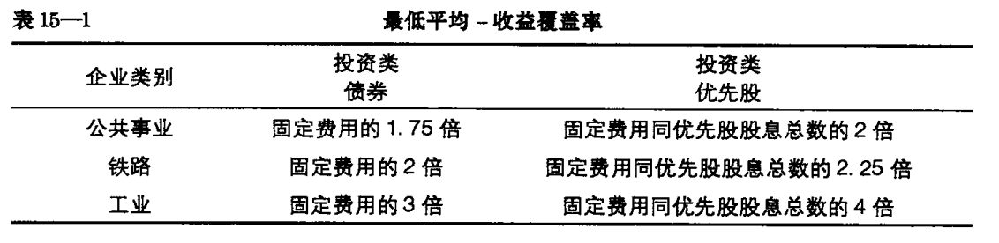

## 一、优先股劣势地位  
1. 股息非强制性发放  
2. 董事倾向代表普通股（公司未来）的权益，牺牲股东权益换区公司发展  
3. 基本都设有保护性条款（不付息时的投票权，非累积优先股更多），限制公司发行优先级更高的股票  
  
风险和收益不能抵消，因此只有高等级的优先股才适合买入  
## 二、收益覆盖率
收益覆盖率 = 公司收益/债券利息  

风险提示指标，尤其在业绩低谷，自由现金流脆弱时更为关键，可以说明公司是否还有能力支付利息以避免偿债风险，以及是否还有融资能力来扭转困境。

r<1 : 情况危急,公司产生的利润连支付银行利息都不够。事实上，当该比率低于1.5时，就要引起投资者的警惕。  
该指标中的利息支出可以在财务报表附注中的财务费用明细中找到。  
### 计算方法  
1. 优先扣除法（应弃用）  
   低级品种计算时先扣除高级品种的利息  
2. 累计扣除法  
   低级品种计算时，与优先品种结合累加计算，高级品种则不考虑低级品种利息  
3. 完全扣除法  
   认为：只有所有利息有保障时才值得投资，故视所有债券具有相同收益率，无论其优先权，均使用累加计算  
~~~  
A公司拥有1000万美元利率为5%的第一抵押债券和500万美元的利率为6%的信用债券。
其平均收益为140万美元,扣除第一抵押债券的利息50万美元(保障倍数是2.8倍)余额
为90万美元信用债券的利息30万美元(保障倍数为3倍)
1. 优先扣除法：信用利息保障倍数为3倍  => 90/30
2. 累计扣除法：信用债券1.75，抵押2.8 => 140/（30+50） || 140/50    
3. 完全扣除法：全为1.75
~~~
## 二、选择优先股  
具有投资价值的优先股必须满足优质债权的所有条件。  
1. 好公司存在投资级别的优先股  
2. 更严格的筛选条件  
     
  
## 三、收益债券和抵押债券  
### 收益债券  
地位居于债券和优先股之间，基本都有到期时间，到期后可无条件收回本金；  
  
总体而言，较投资级别收益较低  
### 担保债券  
担保债券不具备任何特殊的投资品质。也属于投资及债券。  
华尔街倾向于低估担保价值，如果担保人一无所有，其担保也没有价值  
  
公司重组过程中，债权债务优先级低于银行债务