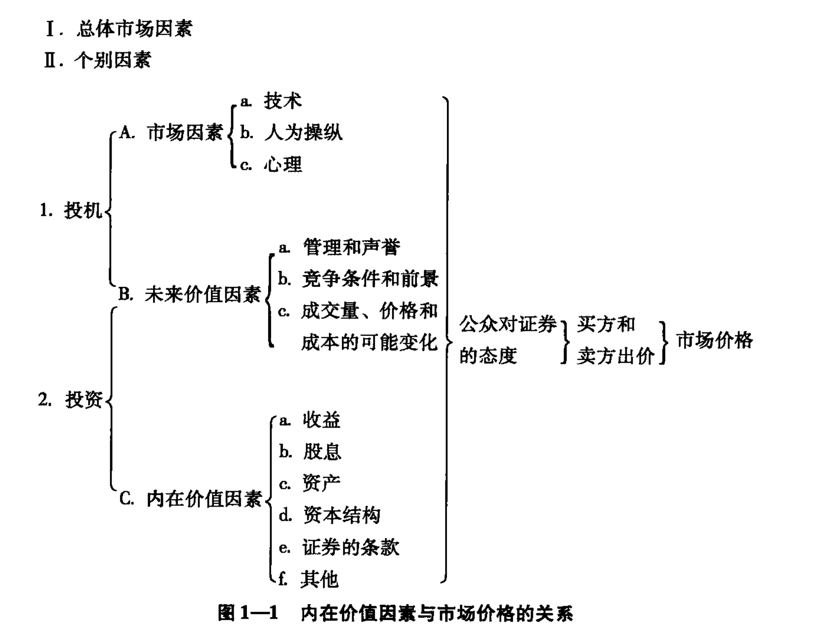

## 内在价值  
内在价值无法具体准确估量，而是用作判断与决定，某一时刻某一价格是否值得购买  
###（1）证券分析的主要障碍：  
1. 数据不足或者不准确  
2. 未来的不确定性  
3. 市场的非理性行为  
  
###（2）分析师的工作  
1. 选择优质、收益固定的证券  
2. 发现市场价格低于或者高于内在价格的证券  
  
### （3）价值回归迟缓  
上面第二点往往不尽人意。偏见与疏忽可导致价格迟迟不能与内在价格对齐（低于或者高于），此间又可能介入新的不确定因素导致价格波动  
分析师方法论：
1. 关注那些公众关注度高的证券，更大程度保证迅速反应其价值要素。  
2. 适应金融市场整体情况。在趋于平缓时发现被低估的证券，当市场压力过大时，谨慎行事。  
### （4）内在价值与市场价值的关系 
  

1. 投资者关心的是赚钱，而不是避免在赚钱的投资环境中的风险。  
2. 寻找相对于其实际价值有大幅折扣的证券 => 最大问题：如何评估价值  
内在价值在实践中上几乎毫无用处，因为无论是市场价格还是平均市场价格，似乎都不受账面价值的制约