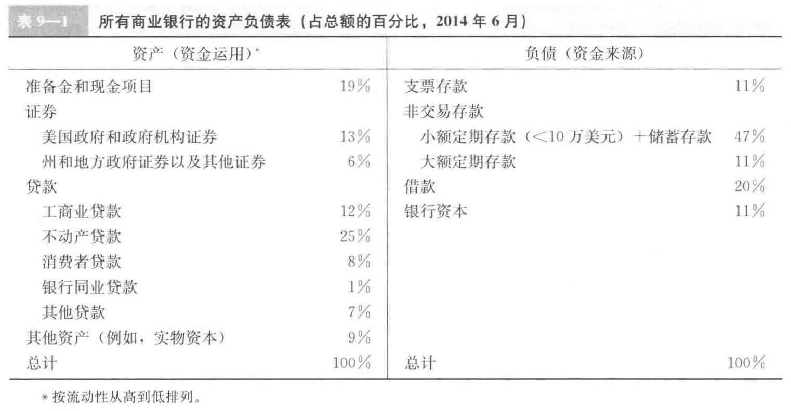

## 一、银行的资产负债表  
  
### （1）负债：银行的资金来源  
1. 支票存款  
   允许持有人向第三方签发支票的银行账户，见票即付
2. 非交易存款  
   是银行的主要资金来源，利息高于支票，但不能签发票  
   1. 储蓄账户：随时存入与支取  
   2. 定期存款：期限固定，如果提前取要支付罚金，利息率较高；大额定期存款可以当做债券交易  
3. 借款  
4. 银行资本  
### （2）资产：资金的运用  
1. 准备金：法定准备金，超额准备金  
2. 托收中款项  
3. 银行同业存款  
4. 证券  
   其中短期证券流动性高，也被称为二级准备金  
5. 贷款：主要利润来源  
## 二、银行管理  
1. 流动性管理  
   主要应对资金外流。存款外流引起的成本越高，银行愿意持有的超额准备金就越多。  
2. 资产管理。  
   多样化持有资产组合，降低风险  
3. 负债管理。  
   低成本获取资金  
3. 资本充足性管理。  
   1. 预防破产  
   2. 规模影响股东的回报  
   3. 监管当局的规模要求  
## 三、利率风险管理  
### 1. 基本缺口分析（basic gap analysis）  
缺口即，利率敏感型资产与利率敏感型负债之差，乘以利率变动幅度，立即可以得到利率变化对银行利润的影响  
1. 期限队列分析（maturity bucket approach）：衡量若干子期限区间缺口来达到衡量长期的目的  
2. 标准化缺口分析（standardlized gap analysis）:考虑不同利率敏感资产与负债的利率敏感程度差异  
### 2. 久期分析（duration analysis）  
证券市值百分比变动 ≈ 利率变动百分比*久期  
## 四、表外业务  
1. 贷款出售  
2. 专业服务收取费用，证券担保、备用信用维度  
  
     
2. 
