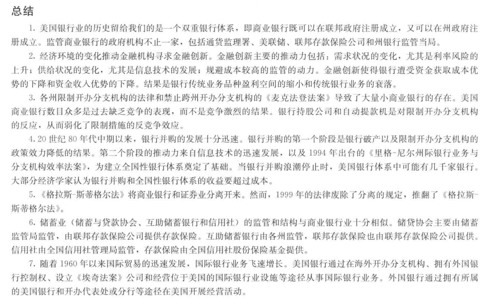

## 1. 双重银行体系（dual bank system）  
由联邦政府管理的银行同由各州政府管理的银行并行运作。  
## 2. 影子银行体系  
银行贷款被证券市场的放款取代  

金融业也在不断发展，发展方向即开发新的金融产品来满足自身与客户的需求。金融环境的变化会推动金融机构进行具有盈利性的创新。  
金融工程：研究与开发新的金融产品  
  
信息技术的发展是投资者很容易获得企业的财务信息  
## 3. 证券化  
证券化是影子银行体系最基本的构成部分。
将众多小额的和不具流动性的金融资产打包在一起转化为可流通资本市场证券。    
### 发起分销模式
证券化流程：发起贷款=>贷款服务=>捆绑=>分销  
这一过程体现了"发起-分销"（originate-to-distribute）的商业模式  
--------  
1. 以下制度成为了金融创新的动力  
   1. 准备金制度。法定准备金事实上是对存款的征税。准备金不能用于投资生产，给存款人的i*r利息便是"税负"。通过金融创新来规避准备金。  
   2. 对存款付息的限制。支票存款不得付息。出现共同基金，支付的份额类似存款但不是存款，规避保证金。  

