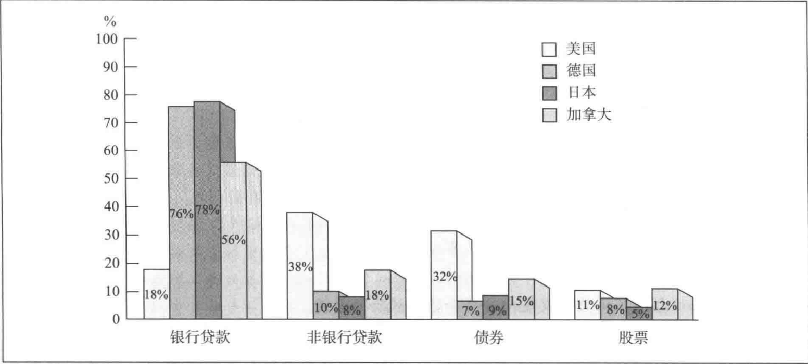
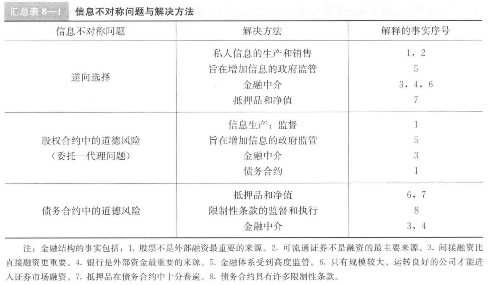

## 一、8个基本事实  

1. 股票不是企业主要的外部融资来源  
2. 发行可流通的债务和股权证券不是企业为其经营活动筹资的主要方式  
3. 间接融资的重要性大于直接融资数倍  
4. 金融中介，特别是银行，是企业外部资金最重要的来源  
5. 金融体系是经济体中最受严格看管的部门  
6. 只有信誉卓著的大公司才能进入金融市场筹资（上市）  
7. 抵押品是居民个人和企业债务合约的普遍特征  
8. 典型的债务合约是对借款人行为设置了许多限制性法律条约  
> 9. 发展中国家的银行地位更为突出。发展中国家信息更加不对称，因此证券被弱化。
## 二、原因  
### 1. 交易成本  
> 小额交易时，手续费占用利息过大比例会导致客户不愿意进行  
  
金融中介降低交易成本：规模经济+专业技术  
### 2. 信息不对称  
逆向选择 + 道德风险  
类似二手车市场，买方不清楚公司信誉与风险，倾向于支付平均价值来购买证券，而公司的所有者如果知道自己公司发展良好，远不止这个均价，自然不愿意压低价格出售，因此证券市场运转自然不好  
  
消除不对称，因而出现了专门的企业出售给买方信息。但因为存在"免费搭车"现象，不能完全解决  
### 3. 道德风险  
道德风险是"事后"，发行者掩盖信息作出对投资者不利的举动  
1. 委托-代理问题  
股权合约面临一定的委托代理问题。经理拥有公司利润很小的一部分，相比股东，没有足够的动力去追求最大利益，甚至会隐瞒真实收益  
  
另外，借款人可能假借风险低的投资活动借款实则进行风险高的投资活动。
2. 解决办法  
监督、政府监管、金融中介  
限制条款：限制行为，限制意愿，要求提供信息
## 三、解释  
事实1-4：逆向选择使得证券市场运转不好。委托代理问题中的高额合适成本。  
事实5：逆向选择，政府监管，促进市场资金有效运转  
事实6：逆向选择，公司规模越大，运转越好，越容易取得信任筹到资金。  
事实7：抵押品的存在降低了逆向选择的危害，是的贷款人更愿意发放贷款。  
事实8：道德风险
> 净值（net worth，又称权益资本）：公司拥有以及别人欠的 - 公司欠别人的  
>  
