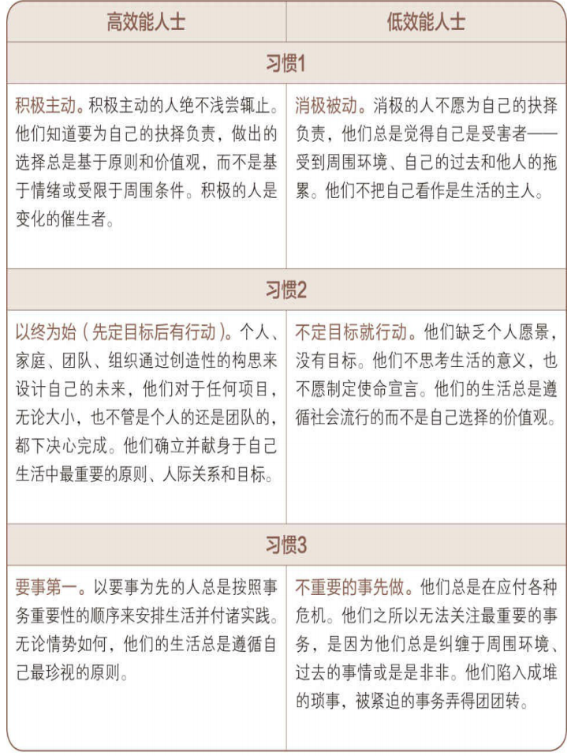

# 7 habits for high productivity
~~~  
I   Be Productive 
II  Begin with the End
III Put first things first
IV  Win-win
V   Understand first, then to understood  
VI  Synergize  
VII SHARPEN THE SAW(???)  
~~~
  
## compatision between high & low pro.  

## 3 stage  
1. dependence  
2. independence  
3. interdependence  
## output（产出） && producve forces(产能)  
long term productive give more output.
## Excerpt  
1. a lovely story  
     
2. 你可以买到员工的时间，却买不到他的心，而心才是忠诚与热忱的 根源；你可以买到员工的体能，却买不到他的头脑，而头脑才是创造力 与智慧的源泉。