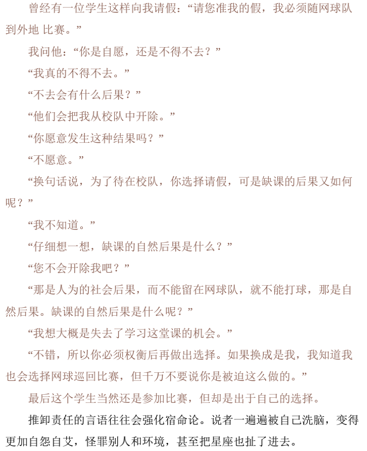

> 最令人鼓舞的事实，莫过于人类确实能主动努力以提升生命价值。——Henry David Thoreau  
## Stage I. dependence to independence.  
(1) passive negative model(we call it REACTIVE): *stimulation => reaction*  
(2) positive proactive: *stimulation => make choice => reaction*  
### I. How to make sure u r reactive or proactive ?  

**Conclusion:**  
Depend on how concentratedly one pay attention to his ***Circle Of Influence*** rather than ***Circle Of Concern***  
  
**two concepts:**
~~~
1. circle of concern : things one concerns which cannot be affected by himself.  
2. circle of influence : things one concerns && can affect.    
~~~  
Generally the inf.circle shold be smaller than the con.circle unless one's too selfish or lack foresight.  
  
There are 3 issues in the circle essensially which we shold take different ways to deal with.  
  1. Directly controllable problems  
  => include Habits.123. we can handle it by develping good habits.  
  2. Indirectily controllable problems  
  => habits.456. Handle it by improved influential methods.
  3. Uncontrollable problems  
  => learn to smile :).  
  

a funny story:  
  
### II. How to be grow proactive?  
**Central Area**  
1. Security  
2. Guidance  
3. Wisdom  
4. Power  

