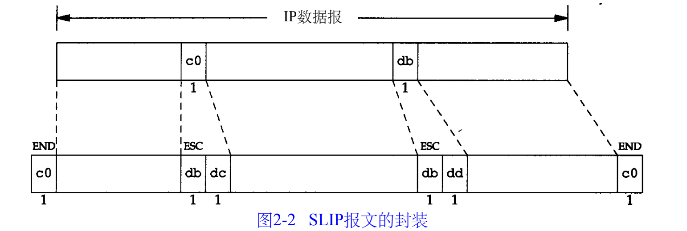

## 一、SLIP串行线路IP  
1. IP数据报收尾加上END（0xc0）,首部加END是为了防止噪音  
2. 若报文中存在END，用两个字节0xdb和0xdc来取代它,0xdb这个特殊字符被称作SLIP的ESC字符  
   若报文存在SLIP的ESC字符（db），两个字节0xdb和0xdd来取代它。  
  

### 缺陷：  
1. 每一端需要知道IP地址，不能传送IP地址  
2. 数据帧没有类型字段，如果线路用于SLIP。则不能同时使用其他协议  
3. 数据帧中没有检验和（类似以太网中的CRC字段）  
### CSLIP：压缩的SLIP协议  
CSLIP一般能把数据报压缩到3或5个字节。  
它能在CSLIP的每一端维持多达16个TCP连接，检测出某些字段一般不会发生变化。对于那些发生变化的字段，大多数只是一些小的数字和的改变。  
这些被压缩的首部大大地缩短了交互响应时间。  
## 二、PPP点对点协议  
