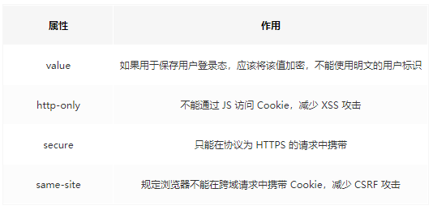
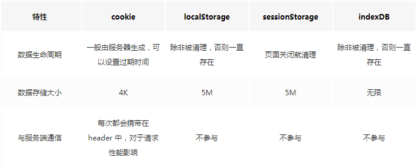

## 一、Cookie  
### 1. 特点
Cookie 的本职工作并非本地存储，而是“维持状态”。  
目的：HTTP协议是无状态的，HTTP协议自身不对请求和响应之间的通信状态进行保存。  
  

### 2. 生成方式  
1. 设置响应报文http response header中的set-cookie。  
   `Set-Cookie: id=a3fWa; Expires=Wed, 21 Oct 2018 07:28:00 GMT;`  
2. js设置  
   通过document.cookie可以读写cookie，以键值对的形式展示  
   `document.cookie = "userName=hello;domain=XXX;Expires=XXX"`  
   Domain 标识指定了哪些域名可以接受Cookie。如果没有设置domain，就会自动绑定到执行语句的当前域。
### 3. 缺陷  
1. 不够大  
   Cookie的大小限制在4KB左右，当 Cookie 超过 4KB 时，会裁剪。  
   很多浏览器对一个站点的cookie个数也是有限制的。  
2. 过多cookie带来性能浪费  
   Cookie 是紧跟域名的。同一个域名下的所有请求，都会携带 Cookie。对于小请求（如静态资源），携带会浪费开销  
3. 安全性问题  
   明文传输  
### 4. 安全性  
  

## 二、localStorage  
### 1. 特点
1. 保存的数据长期存在，下一次访问该网站的时候，网页可以直接读取以前保存的数据。
2. 大小为5M左右
3. 仅在客户端使用，不和服务端进行通信
4. 接口封装较好
### 2.使用  
LocalStorage 的特点之一是持久，有时我们更倾向于用它来存储一些内容稳定的资源。比如图片内容丰富的电商网站会用它来存储 Base64 格式的图片字符串：
```  
// 设置/获取localstorage  
localStorage.setItem("key","value");
localStorage.getItem("key");
```  
## 三、sessionStorage  
### 1. 特点  
> 会话级别的浏览器存储  
> 大小为5M左右  
> 仅在客户端使用，不和服务端进行通信  
> 接口封装较好  
1. 保存的数据用于浏览器的一次会话，当会话结束（通常是该窗口关闭），数据被清空；  
2. 特别的一点在于，即便是相同域名下的两个页面，只要它们不在同一个浏览器窗口中打开，那么它们的 sessionStorage 内容便无法共享；  
3. localStorage 在所有同源窗口中都是共享的；cookie也是在所有同源窗口中都是共享的。除了保存期限的长短不同，SessionStorage的属性和方法与LocalStorage完全一样。  
### 2. 解释  
sessionStorage 更适合用来存储生命周期和它同步的会话级别的信息。这些信息只适用于当前会话，当你开启新的会话时，它也需要相应的更新或释放。比如微博的 sessionStorage就主要是存储你本次会话的浏览足迹：  
### 3. 比较  
localStorage只要在相同的协议、相同的主机名、相同的端口下，就能读取/修改到同一份localStorage数据。sessionStorage比localStorage更严苛一点，除了协议、主机名、端口外，还要求在同一窗口（也就是浏览器的标签页）下  
  
## 四、indexedDB  
> 1. 存储空间大:一般来说不少于 250MB，甚至没有上限。  
> 2. 支持二进制储存。不仅可以储存字符串，还可以储存二进制数据（ArrayBuffer 对象和 Blob 对象）  
> 3. 支持事务、同源、异步、键值对  
### 使用  
[走你！](https://juejin.im/post/59bb2e755188257e7852d40f)

对比：  
