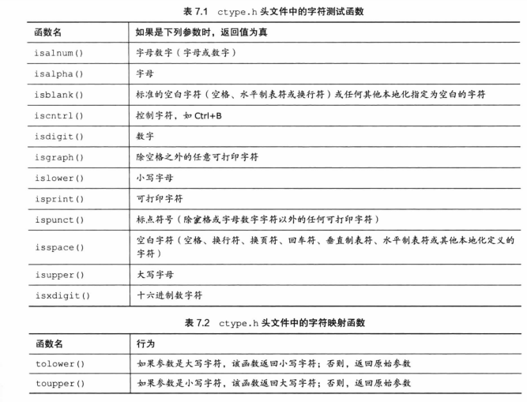

## 运算符、表达式、语句  
1. 递增递减运算符  
   因为C编译器可以自己选择参数的执行顺序（如printf("%d%d",i++,i++),虽然最终i会加2，但可能先加1传值给下一个后再加一，也可能两个全部传值后再加一）  
   > 一个变量多次出现在参数中、表达式中不要用递增递减  

2. 序列点：所有副作用再进入下一步之前执行，分号。  
3. 涉及两种类型的运算，会转换成高级类型，称为升级：  
   `long double > double > float >unsighedlong long > long > long long > unsighed long > long > unsighed int >int`
## 分支与跳转  
1. ctype.h头文件  
