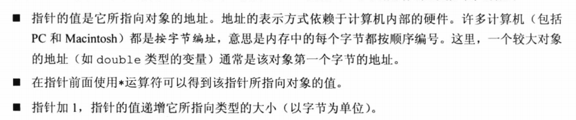

1. getchar()读取的都会转化为int，EOF为-1  
   在一行开始出输入ctrl+D(UNIX)或者ctrl+Z(DOS)模拟结束符
2. scanf读取完一行之后会把上次的换行符留在输入缓存区，当混合使用getchar时注意处理这个换行符。  
3. C函数有自己的变量，即使A函数传给B函数内部参数C，但A中的C，和B中的参数C地址不一样。  
4. 数组  
   1. 声明数组时不指定大小，数组会根据初始化的时的数组决定大小  
   2. 未初始化的数组，数组元素为内存上现有值（垃圾值）;初始化的数组，如果元素少于声明个数，会初始化为0  
   3. 指定初始化器。会将指定初始化后的元素放在该元素后面，即按顺序排列下去。若未声明，则会初始化至能装下所有元素为止。  
   4. 编译器不会检查边界，这样会使速度更快。  
   5. 数组名是该首元素的地址。  
5. 指针  
   1. 指针加一指向下一个存储单元，如short类型(2字节)的元素，下一个单元就是：(%p+1)=>十六进制地址+2  
   2. 一元运算法*与++、--的优先级相同，比+-高  
     
   3. 指向多维数组的指针：int (*p) \[3\]，p是指向含三个int类型的数组的指针。