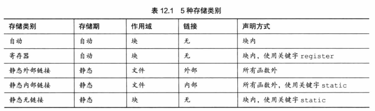

## 一、基本概念  
1. 翻译单元：源代码文件以及其包含的头文件可看做一个整体的单元，即翻译单元。(处理#include时，实际上是使用文件内容替换#include指令)  
2. 链接：  
   + 无连接变量：块作用域，函数作用域，函数原型作用域都是无连接变量  
   + 外部链接变量：可以在多文件程序中使用  
   + 内部链接变量：只能在一个翻译单元使用  
   + 内部链接作用域，简称文件作用域(static声明)  
   + 外部链接作用域，简称全局作用域或者程序作用域  
3. 存储器：  
   1. 静态存储期：程序的执行期间一直存在且会持续记录，即前面的调用会影响后面的取值。文件作用域变量都具有静态存储期。
   2. 线程存储期：用于并发程序设计，从声明到线程结束一直存在。以关键字_Thread_local声明一个变量时，每个线程都获得该变量的私有备份。  
   3. 自动存储期：块作用域变量。进入该变量所在块时为其分配内存，退出即释放。  
## 二、五大存储类别
  
### 1. 自动变量
1. 关键字auto声明表明为自动变量：自动存储期，块作用域，无连接。为和C++兼容，不建议使用。  
2. 新变量重名共作用域下会隐藏就变量地址。  
### 2. 寄存器变量  
1. register声明  
2. 可能存储在寄存器，编译器会根据寄存器数量衡量请求，可能会直接忽略。  
2. 不可地址访问，大小受限(不可存储double类型)  
### 3. 
   
