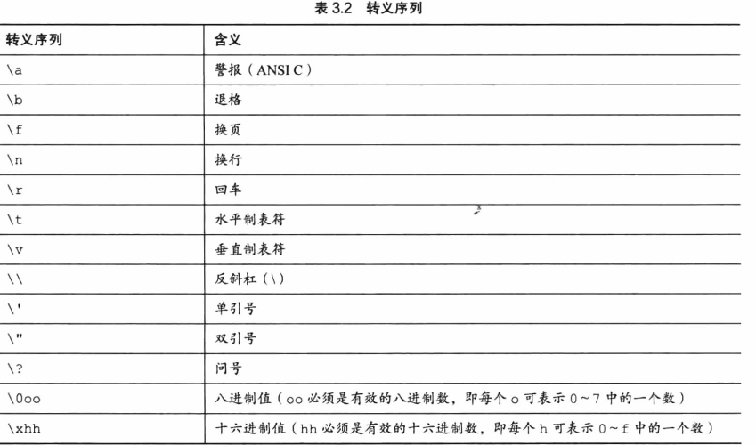

## 一、特殊字符
~~~  
%c : char
%s : 字符串
%d : 十进制显示整数int  
   %o:八进制
   %x：十六进制
   % # d/o/x:显示对应进制的前缀，如 %x=64，%#x=Ox64  
%f : 浮点数float  
   %.nf:.n用于控制精度，显示小数点后面n位。
%e : 指数计数法的浮点数
%u : unsighed搭配h,l，表示无符号
   %ul:unsighed long
%h : short
   %hx:十六进制short
   %ho:八进制short
~~~  

## 二、char类型  
> 注意：严格区分！！！单引号表示字符，双引号字符串，混淆进行赋值会报错  
  
char类型存储字符，但技术层面上char是整数类型，计算机使用数字编码来处理字符，美国最常用的ASCII编码，如65=>A.蜂鸣字符=>7  
  
通常chat被定义为8位的存储单元。  
## 三、转义字符  
  
\a不移动活跃位置（光标位置）  
八进制字符常量：\nnn，n<8,如蜂鸣：\007  
## 四、可移植类型  
stdint.h和inttypes.h  
## 五、float和double  
1. Float  
   1. C标准规定，float值少表示6位有效数字，取值范围至少是10^-37~10^+37.  
   2. 通常系统存储一个浮点数要占用32位，其中8位表示指数和符号，24位表示有效数字及其符号  
2. Double  
   1. double最小取值范围也是10^-37~10^+37，但至少能表示10位有效数字  
   2. 一般占用64位，多出的32位全部用来表示有效数字，即精度更高  
3. 浮点数常量：如2.0  
   1. 默认情况编译器假定其为double类型的精度。如`float a=4.0*2.0`进,行双精度运算（4.0*2.0），会运算完截取成float类型的宽度，精度更高，但速度慢  
   2. 在浮点数后面加上后缀f/F(float)或者l/L(double)替换默认  
## 六、补充  
1. 声明量与赋值类型不一致会转化成声明量，会舍弃一定位数。如`int a = 12.99 => a=12`