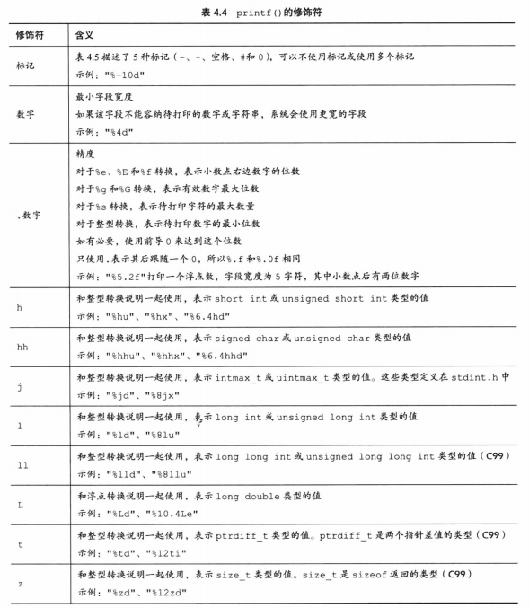
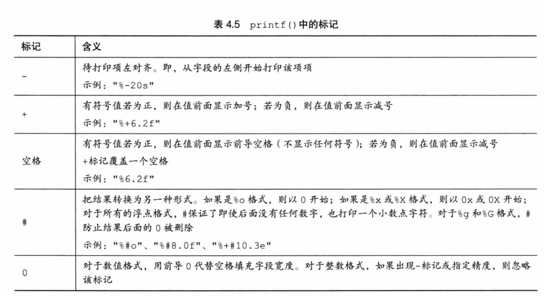

# 字符串与标准输入输出  
## 字符串  
字符串在内存存储中以\0结尾，故字符串常量"x"与字符常量'x'不同，前者在内存中实际上是字符'x'和空字符'\0'  
1. scanf("%f",&a)读取时遇到空格符便结束了。  
2. strlen()不包含空字符，sizeof()会  
3. \# define NAME value:编译时替换，编译程序时所有的NAME会被替换为value，这样定义的常量也成为了明示常量。  
    C90新增const  
## printf  
返回打印字符的个数，如果输出有错误则返回一个负值  
指定宽度对打印列很有用，保证美观
转换说明修饰符  
  
printf标记  
  
*在printf指定变宽输出字符，在scanf指定跳过字段。