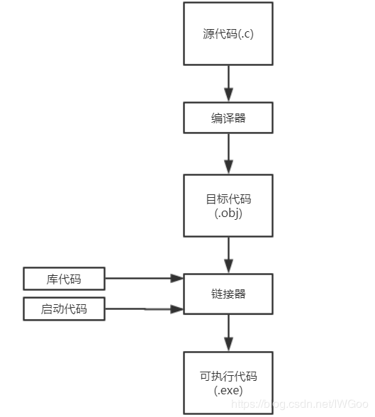

# 练习题部分  
1. 什么是完美可移植性？  
    指能够移植到其他计算机系统而无需修改源代码  
2. 源代码文件、目标代码文件和可执行文件有什么区别？  
    ~~~  
    源代码文件包含程序员使用的任何编程语言编写的代码。
    
    目标代码文件，即源代码文件编译后的机器语言代码（不含库函数和启动代码，尚未链接整合）。
    
    可执行文件，即源代码文件编译后的完整机器语言代码（含库函数和启动代码，已经链接整合）。
    ~~~  
      
3. 编译器和连接器的作用？  
    
    