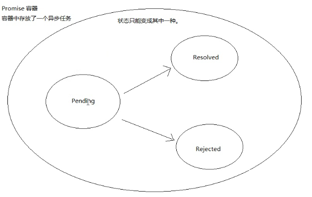

# Promise  
异步编程无法保证执行顺序，一般采用嵌套，然鹅...
### 1.回调地狱  
回调函数多重嵌套，导致代码可读性和维护性差  
### 2.闪亮登场  
Promise：ES6的一个API  
概念图：  
  
注：pending状态 =>正在执行  
　　　|->(fullfilled)resolved => 成功完成状态  
　　　|->rejected => 失败完成状态  
状态改变后不可再改变  
### 3.使用  
1. 创建Promise容器
    ```
    var p1=new Promise( (resolved, rejected)=>{
        synFunc()
    })
    ```  
   容器一旦创建立马执行里面的代码，其构造函本身是同步的的，但里面的函数通常都为异步函数  
2. then方法  
    ```
    var p1=new Promise( (resolved, rejected)=>{
        sysFunc((err,data)=>{
                if(err){ rejected(err) }
                else{ resolved(data) }
        })
    })
    
    pi.then( function(data){} ,funcion(err){})
    ``` 
    + resolved()即调用then的第一个参数函数；rejected()调用第二个  
    + 当前函数return的数据就可以在后面的then的function中接收到  
    + **当return一个Promise对象时，后续then的第一个方法会作为p2的resolved...**  
    ```
    var p1=Promise()
    var p2=Promise()
    var p3=Promise()
    //then形成链式调用
    p1.then(func(return p2)).then(func(return p3)).then(...)
    ```  
3. catch方法  
　　效果和写在then的第二个参数里面一样。不过它还有另外一个作用：在执行resolve的回调（也就是上面then中的第一个参数）时，如果抛出异常了（代码出错了），那么并不会报错卡死js，而是会进到这个catch方法中。  
　　这里的reason可以打印出错误信息，而js代码可以继续向下执行  
    ```
    getNumber()
    .then(function(data){
        console.log('resolved');
        console.log(data);
    })
    .catch(function(reason){
        console.log('rejected');
        console.log(reason);
    });
    ```　　
4. all方法  
　　用Promise.all来执行，all接收一个数组参数，里面的值最终都算返回Promise对象。这样，三个异步操作的都会执行，等到它们都执行完后才会进到then里面。  
    ```
    Promise
    .all([runAsync1(), runAsync2(), runAsync3()])
    .then(function(results){
        console.log(results);
    });
    ```
   　　那么，三个异步操作返回的数据哪里去了呢？都在then里面呢，all会把所有异步操作的结果放进一个数组中传给then，就是上面的results  
5. race方法  
    　　类似all,数组里的函数都会执行，但会根据最先返回的promise对象决定下一步操作 
    ```
    Promise
    .race([runAsync1(), runAsync2(), runAsync3()])
    .then(function(results){
        console.log(results);
    });
    ```
5. 简单封装  
    ```
    //因为Promise构造函数会自动执行，所以一般用函数包装一层，返回Promise对象。在需要调用时调用函数即可
    function runAsync1(){
        var p = new Promise(function(resolve, reject){
            //做一些异步操作
            setTimeout(function(){
                console.log('异步任务1执行完成');
                resolve('随便什么数据1');
            }, 1000);
        });
    return p;            
    }
    
    //then调用链，简单理解，就是把原函数的回调函数放入了then中，使得回调有序
    runAsync1()
    .then(function(data){
        console.log(data);
        return runAsync2();
    })
    .then(function(data){
        console.log(data);
        return runAsync3();
    })
    .then(function(data){
        console.log(data);
    });
    ```  
7. Promise内部的错误外界用try-catch捕捉不到，得用.catch()处理  
## Async-await  
async-await就是寄生于Promise，Generator的语法糖，async用于申明一个function是异步的，而await可以认为是async wait的简写，等待一个异步方法执行完成。  
```
async function demo() {
    let result = await Promise.resolve(123);
    console.log(result);
}
demo();
```  
+ async声明函数为异步，await执行上下文必须在该函数里面（await放在普通函数里是会报错的）  
+ await后接promise对象，表示等待后面的返回结果后再继续执行  
+ 错误处理：在函数内部用try..catch处理，但是当内部出现一些错误时，和上面Promise有点类似，demo（）函数不会报错，还是需要catch回调捕捉。这就是内部的错误被“静默”处理了。  
    ```
    let p = new Promise((resolve,reject) => {
        setTimeout(() => {reject('error');},1000);});
    
    async function demo(params) {
        try {
            let result = await p;
        }catch(e) {
            console.log(e); }}
    
    demo();
    ```

