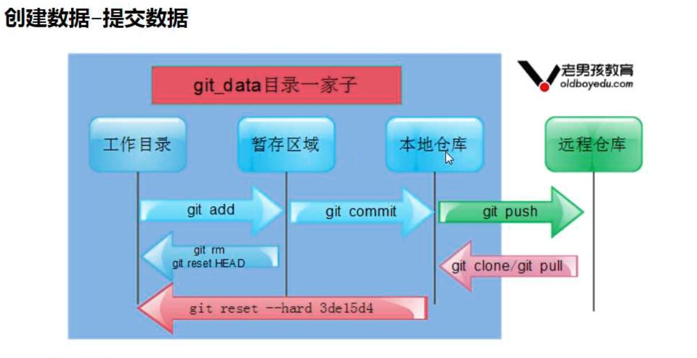

# Git  
Git是一个分布式版本管理系统，可以使用它对项目版本回溯，更新，建立新的分支，且每次操作都会保留记录，可以任何时候复原到指定版本，方便多人协作  
## 一、配置git用户信息  
配置用户名：`# git config --global user.name 'xujunyuan'`  
配置邮箱：`# git config --global user.email 'junyuanblog@163.com'`  
设置语法高亮：`# git config --global color.ui true`  
## 二、初始化git  
1. 进入目录后运行命令：`git init`，会生成.git的隐藏文件  
   ```
   config　     　定义项目特有的配置选项
   description　　仅供git web程序使用
   info          包含一个全局排除文件(exclude文件)，用于配置不在.gitignore中的忽略模式
   hooks         包含git钩子文件
   HEAD          指示当前被检出的分支
   objects　　    存放所有数据内容，有info和pack两个子文件夹
   refs          存放指向数据(分支)的提交对象的指针
   index　      　保存暂存区信息，在执行git init的时候，这个文件还没有
   ```
2. 查看现在的状态：`git status`  
     
## 三、基本操作  
### 1.添加  
添加文件到暂存区：`git add file`  
添加所有文件到暂存区：`git add .`  
### 2.删除  
取消存入暂存区：`git rm --cached filename`  
从暂存区直接彻底删除：`git rm -f filename`  
### 3.提交  
代码只有提交本地仓库，commit后才真正被管理起来  
提交到本地仓库：`git commit -m "注释内容"  //m即msg`  

如果文件已经被仓库管理，此时更改可以直接：`git commit -am '注释'  //a即先add`
### 4.重命名  
直接mv改名git会识别为删除了源文件  
git改文件名：`git mv old new`  
### 5.比对不同  
比对工作目录与暂存区：`git diff`  
比对暂存区与本地仓库：`git diff --cashed`  
### 6.回滚  
所有文件回滚：`git reset --hard 结点哈希`
### 7.查看指针状态和日志  
只显示当前分支的log:
   1. 查看用户提交记录：`git log `  
   2. 查看简短显示` git log --oneline`  
   3. 查看具体内容变化：`git log -p`  
   4. 只显示一条内容：`git log 1`  
   
查看当前指针指向：`git log --oneline --decorate`  
显示所有log，包括回滚的：`git reflog`  
## 四、git分支  
创建git分支仅自己可见，不会影响其他人的代码编写。实际开发中我们要保证master尽量稳定，用于发布新版本。  
### 1. 创建与删除  
新建分支：`git branch bName`  
查看当前所在分支：`git branch`  
删除分支：`git branch -d bName`  
### 2. 切换  
切换分支：`git checkout bName`  
创建并切换到分支：`git checkout -b bName`  
### 3. 合并分支  
合并分支：`git merge bName`  
合并如果遇到代码冲突，会先合并，但冲突文件会被改动，需要手动修改代码  
### 4.标签  
给当前分支加上标签，这样在回滚时无需输入繁琐的哈希值，方便操作  
打标签：`git tag -a 标签名 -m 注释   # -a指定标签名`  
删除标签：`git tag -d 标签名`  
查看存在的标签名：`git tag`  
查看标签对应的分支：`git show 标签名`  
回滚到标签状态：`git reset --hard  标签名` 
## 五、远程仓库  
