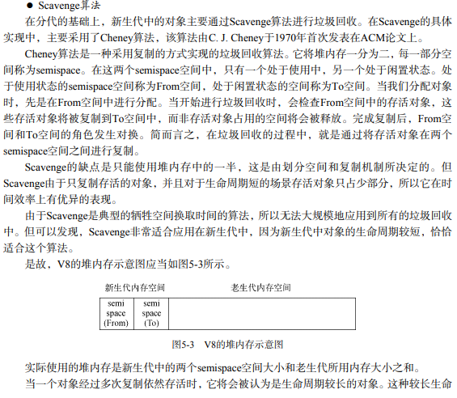

## 一、内存限制  
查看内存：`processe.memoryUsage()`  
V8内存(注意是V8，Buffer没有)具有限制，64位约为1.4GB，32位约为0.7GB。  

两层原因：  
1. 最初为浏览器设计，内存大小已经足够  
2. 根本原因：V8垃圾回收机制的限制。以1.5G的垃圾回收堆为例，V8做一次小的垃圾回收需要50ms，做一次非增量的垃圾回收就要1s以上，如此时间花销下性能和用户体验直线下降。  
  
强行更改限制(初始启动时更改生效，启动后无法动态改变)：  
`node --max-old-space-size=1700 test.js // 老生代内存，单位为MB`  
`node --max-new-space-size=1024 test.js // 新生代内存，单位为KB`

## 二、V8垃圾回收机制  
分代式垃圾回收。  
~~~  
人们发现对于没有唯一的垃圾回收方式可以胜任所有应用场景。对象的生命周期长短不一，  
现代的垃圾回收将内存的垃圾进行不同的分代，对不同的分代是以更高效的算法。  
~~~  
1. 新生代（默认64：32MB，32：16MB；由两个reserved_semispace_size_组成，16MB-8MB）  
2. 老生代（默认64：1400MB，32：700MB）。  

最大保留空间：（1464MB-732MB）= 4*reserved_semispace_size_ + max_old_generation_size_Ὑ    
### 1. 新生代算法  
  
满足以下条件可以晋升为老生代  
1. 对象从From空间复制到To空间时，会检测是否已经经历过一次回收算法，是则移入老生代  
2. To空间已经使用超过了25%，直接晋升。  
### 2. 老生代算法  
V8主要使用Mark-sweep，在空间不足以对新来的对象进行分配空间时，才是用Mark-Compact。
1. Mark-Sweep，标记清除，会有碎片产生  
2. Mark-Compact，清除后向一端移动，减少碎片，速度最慢。  
### 3. 增量标记  
为了保证js应用逻辑与垃圾回收现状一致，垃圾回收需要将应用逻辑停下，待回收完成后再恢复执行。称为“全停顿”。新生代影响较小，老生代庞大停顿时间较长。  
  
增量标记：标记阶段分为许多小步进行，每次进行完一步让js应用执行一会，交替进行。  

可使最大停顿时间减少到1/6，后续还引入了延迟清理，增量清理以及并行清理并行标记等（需要利用多核）。  
### 4. 查看垃圾回收日志  
1. 启动时加上参数`--trace_gc`将会打印垃圾回收的日志信息，`> gc.log`生成日志文件  
2. 参数`--prof`可以得到V8执行时的性能分析，会自动生成V8.log文件，但可读性差，可通过工具linux-tick-processor统计。该工具在Node源码`deps/v8/tools`下  
   运行：`$ linux-tick-processor v8.log`即可得到分析结果。  
  
## 三、内存优化  
1. 全局变量会在进程结束后才会清楚，通过`delete xxx` or `xx=null`解除引用。  
2. 注意闭包会保存引用作用域链里的活动对象，占用内存。  
3. 慎重将内存当缓存使用。建议用外部缓存，redis等  
   ```  
   手动实现：设置limit，队列保存keys,{}保存键值对，当keys.length大于limit时出队并去键值对。
   ```  
4. 关注队列状态。（队列经常被用来充当消费的中间产物，如数据库录入操作，当许多操作发生堆积时，相关作用域也得不到释放）  
5. 相关内存泄漏排查工具  
## 四、大内存应用  
Node提供stream模块。继承自EventEmitter.  

由于V8的内存限制，我们无法对大文件直接使用fs.readFile()、fs.writeFile()。而采用流的方式：fs.createReadStream()和fs.createWriteStream()  
```  
var reader = fs.createReadStream('in.txt');
var writer = fs.createWriteStream('out.txt');
reader.on('data', function (chunk) {
    writer.write(chunk);
});
reader.on('end', function () {
    writer.end();
});

// 简便版本
var reader = fs.createReadStream('in.txt');
var writer = fs.createWriteStream('out.txt');
reader.pipe(writer);  // pipe()封装了data事件和写入。 
```