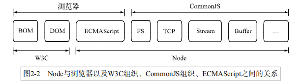
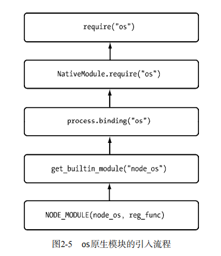

# node模块系统  
借鉴CommonJS（注意不是完全一样的）  
传统JS缺陷：  
1. 没有模块/包管理系统  
2. 标准库少（如fs,IO）  
3. 缺少标准接口(如DB)  
  
## 一、Node模块  
### 1. CommonJS规范  
在Node中，一个模块，将内容挂载到exports对象上实现导出。
模块引用：`const math = require('math');`  
模块导出：`module.exports={} / exports为其引用，为防止引用变量覆盖覆盖，慎用。`  
### 2. Node的模块实现  
模块分为两类：核心模块（自带），文件模块（用户编写）  
模块引入分三步：(1)路径分析(2)稳健定位(3)编译执行  
> 注意：缓存优先！require二次加载一律缓存优先  
> 核心模块在源代码编译时已经编译进了二进制执行文件，启动Node进程时会被加载进内存，故引入可跳过路径分析与文件定位，且路径分析优先，故加载速度最快  
#### （1）路径分析  
以",/"或者"../"开头会被当做文件模块。查找时根据路径数组(module.paths)查找node-modules中的文件,如：  
```  
[
  'D:\\web\\rdemo\\rdemo\\server\\node_modules',
  'D:\\web\\rdemo\\rdemo\\node_modules',
  'D:\\web\\rdemo\\node_modules',
  'D:\\web\\node_modules',
  'D:\\node_modules'
]
```  
#### （2）文件定位  
缓存优先；除此之外，含文件扩展名的分析、目录和包的处理  
1. 文件扩展名分析  
   需要调用fs模块同步阻塞式判断文件是否存在，如果是.node或.json文件带上扩展名或加快速度；  
   > 诀窍：同步配合缓存，可大幅度缓解单线程阻塞式调用缺陷  
2. 目录分析和包  
   分析扩展名后可能没找到文件，而有个相应的目录。此时会将目录当做包导入。 
    
   node会调用JSON.parse()解析package.json生成对象，此时的package.json需要指定main属性，否则导入包需要require("具体到入口文件名")  
     
   如果没指定或者没有package.json，会默认找index.XXX文件，也没有则找下一个路径，都没有报错。  
#### (3) 文件编译  
定位到文件后，根据不同后缀名解析文件：  
1. .js文件。通过fs模块同步读取后编译执行；除以下的其他文件也当成js文件。  
2. .json文件。fs模块同步读取，调用JSON.parse返回结果。即如果我们定义json文件作为配置，直接require就行，无需fs。  
3. .node文件。这是C/++编写的扩展文件，调用dlopen方法加载最后编译生成的文件  
  
编译原理补充：  
1. 每个文件模块都是一个对象，定义如下  
    ```  
    function Module(id, parent) { 
        this.id = id; 
        this.exports = {}; 
        this.parent = parent; 
        if (parent && parent.children) { 
        parent.children.push(this); 
        } 
        this.filename = null; 
        this.loaded = false; 
        this.children = []; 
    }
    ```  
2. Node会对编译的js文件进行头尾包装，头部添加(function (exports, require, module, __filename, __dirname) {\n，尾部添加 \n});。所以才能在模块（包括核心模块）中使用__filename等参数。  
  
   包装后的代码会通过原生模块(vm)执行返回一个function对象，具有明确上下文，实现作用域隔离。  
## 三、核心模块  
核心模块分为C++和js写的两部分，C保存在项目的src目录下，js保存在lib目录下。  

核心模块的引入流程：  
  
详情见书2.4-2.5  
## 四、包与NPM  
完全符合CommonJS的包结构如下：  
1. package.json包描述文件  
2. bin存放可执行二进制文件  
3. lib存放js代码  
4. doc文档  
5. test单元测试用例  
### 1. npm命令  
```  
npm -v:查看版本  
npm init:生成package.json文件
npm install/uninstall xxx:安装/卸载  
    -g:安装为全局可用的“可执行命令”，会根据bin字段，在node可执行文件下生成对应的软连接
       如node可执行命令目录：/usr/local/bin/node，则模块目录：/usr/local/lib/node_module  
    --registry:更改默认源  
npm config set registry http://registry.url ：永久修改默认源
npm ls:列出当前能通过模块路径require的所有包

npm publish <folder>:上传包.folder为package.json所在目录，可用相对路径。
npm owner ls <package name> ：管理包的拥有、管理者
npm owner add <user> <package name>
npm owner rm <user> <package name>  
```  
### 2. npm钩子命令  
```  
"scripts": {
  "preinstall": "preinstall.js",  //npm install packge时会先执行该脚本，然后执行下面的install脚本
  "install": "install.js",
  "uninstall": "uninstall.js",    //执行uninstall时，可执行某些清理工作
  "test": "test.js"
} 
```  
## 五、其它规范  
[ES6，AMD，CMD](../../js/模块化.md)