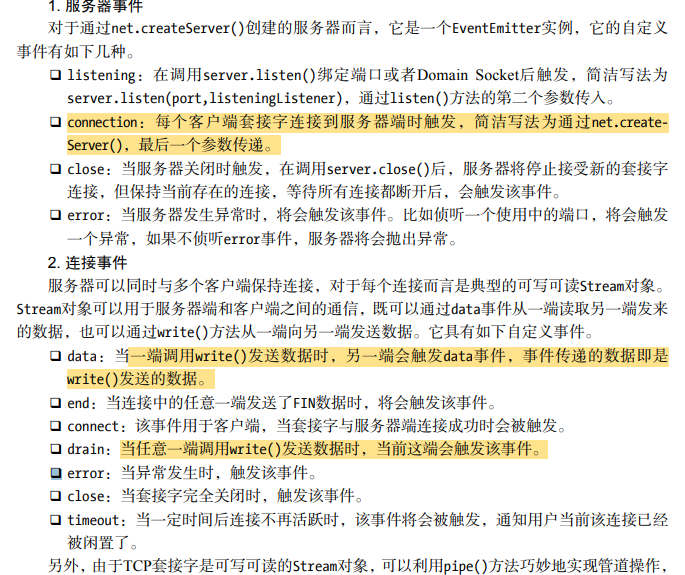
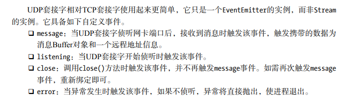

## 一、TCP传输控制协议  
> 套接字（socket）  
> 是一个抽象层，应用程序可以通过它发送或接收数据，可对其进行像对文件一样的打开、读写和关闭等操作。套接字允许应用程序将I/O插入到网络中，并与网络中的其他应用程序进行通信。网络套接字是IP地址与端口的组合。  

TCP需要建立连接(三次握手)，一旦建立，所有的会话都是基于链接完成的，客户端与另一个TCP服务通信需要另创建一个套接字。  

### （1）搭建服务端  
```  
const net = require('net');

let server = net.createServer(function (socket) {
    // 新的连接
    socket.on('data', function (data) {
        socket.write("你好 ;("
    });
    socket.on('end', function () {
        console.log('连接断开');
    });
    socket.write(“深入浅出Nodejs\n");
});
server.listen(8124, function () {
    console.log('server bound');
}); 
```
### （2）搭建客户端  
```  
const net = require('net');

let client = net.connect({port: 8124}, function () { //'connect' listener
    console.log('client connected');
    client.write('world!\r\n');
});
client.on('data', function (data) {
    console.log(data.toString());
    client.end();
});
client.on('end', function () {
    console.log('client disconnected');
});
࠱以上客ਖ਼
```  
### （3）事件  

## 二、UDP用户数据包协议  
UDP中，一个套接字可与多个UDP服务通信，提供面向事务的简单不可靠信息传输服务，网络差时丢包严重。但无需连接，处理快速，资源耗费低，灵活，常用于音频视频。DNS也是基于此实现的。  
### （1）创建服务端
```  
// 创建UDP套接字  
const dgram = require("dgram");
let server = dgram.createSocket("udp4");

server.on("message", function (msg, rinfo) {
    console.log("server got: " + msg + " from " +
    rinfo.address + ":" + rinfo.port);
});
server.on("listening", function () {
    let address = server.address(); 
    console.log("server listening " +
    address.address + ":" + address.port);
 });
// 绑定网卡和端口，该套接字将接受该端口上的所有信息，绑定完成后触发listening事件
server.bind(41234);  
```  
### （2）创建客户端  
```  
cosnt dgram = require('dgram');

let message = new Buffer("深入浅出Nodejs");
let client = dgram.createSocket("udp4");

// socket.send(buf, offset, length, port, address, [callback]) 
client.send(message, 0, message.length, 41234, "localhost", function(err, bytes) {
    client.close();
}); 
 ```  
   
## 二、HTTP超文本传输协议  
基于TCP的应用层协议，无状态。  
1. http服务开启keepalive后，一个TCP会话可用于多次请求与相应。  
2. HTTP以request为单位进行服务，TCP服务以connection为单位进行服务。  
3. HTTP模块即将connect到request进行了封装。  
### API使用  
1. setHead,writeHead,end。  
   只有调用了writeHead后报头才会开始写入连接中。end会先调用write()发送数据，然后发送信号告知本次响应结束。结束时一定要调用end，否则客户端会一直处于等待状态。  
2. 报头是在报文体发送前发送的，一旦开始数据发送，writeHead和setHead将不再生效。  
## 三、[WebSocket协议](https://segmentfault.com/a/1190000012948613)  
1. 只需要一个TCP链接  
2. 服务端可以主动推送  
3. 更轻量的协议头，减少数据量。  

建立连接后，双方可以互相传输数据，概念单位为：“消息”。在线路上，一个消息是由一个或多个帧的组成。 WebSocket 的消息并不一定对应于一个特定的网络层帧，可以作为一个可以被一个中间件合并或分解的片段消息。  
### 使用：  
1. socket.io封装。
2. onopen/onclose/onmessage/close/send等原生方法。  
## 四、TLS/SSL安全套接字协议 => https  
1. 生成RSA私钥文件
    ```  
    // 生成服务器端私钥
    $ openssl genrsa -out server.key 1024
    // 生成客户端私钥
    $ openssl genrsa -out client.key 1024 
    ```  
2. 利用私钥生成公钥  
    ```  
    $ openssl rsa -in server.key -pubout -out server.pem
    $ openssl rsa -in client.key -pubout -out client.pem 
    ```  
3. 引入CA认证，通过私钥自签名生成证书。  
    ```  
    $ openssl genrsa -out ca.key 1024
    $ openssl req -new -key ca.key -out ca.csr
    $ openssl x509 -req -in ca.csr -signkey ca.key -out ca.crt   
    ```  
4. 生成CSR文件  
    ```  
    $ openssl req -new -key server.key -out server.csr 
    ```  
5. 使用CA证书与私钥颁发带有CA签名的证书  
   ```  
   $ openssl x509 -req -CA ca.crt -CAkey ca.key -CAcreateserial -in server.csr -out server.crt 
   ```