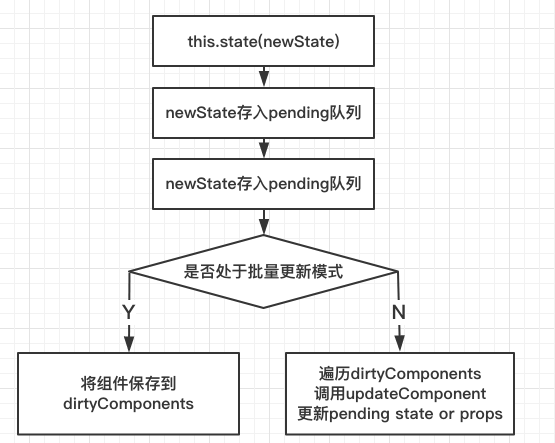

  
## 1. 属性  
React的属性即组件的输入,即props，属性是只读的，不能进行更改。  
  
static defaultProps方法可以设置默认属性，对于公共组件，应 为属性添加默认值，这样组件才会更健壮，使用起来也会更简捷。  
  
参数校验可以提高健壮性。React提供了prop-types进行校验  
~~~  
import PropTypes from 'prop-types’; 
class User extends Component { 
    propTypes : { 
        name: PropTypes.string.isRequired,
        age:PropTypes.number, 
    }
}
~~~  
## 2. 状态  
组件拥有自身的状态，即刷新页面不会保持的信息。  
  
setState(newState,callback)，当setState执行完成后，界面会自动更新。    
setState在合成事件中是异步的，为了性能优化，会合并进行操作。  
render中不要调用setState！！！
  

案例：实现递增  
```  
componentDidMount() {
    this.id = setInterval(()=>{this.setState({name:this.state.name+1})},1000)
}
componentWillUnmount() {
    clearInterval(this.id)
}

let [name,setName] = useState(0)
useEffect(()=>{
    let id = setInterval(()=>{
        setName(pre=>pre+1)
    },1000)
    return id
},[])
```  
## 3. 事件  
1. React中的驼峰命名事件都是合成事件，符合W3C标准屏蔽了浏览器差异  
2. 所有时间均绑定在最外层(document)上，通过事件代理完成。  
3. 如果需要访问原生事件对象，可以使用 nativeEvent 属性。  
   ```  
   onClick(e) { 
       e.nativeEvent ／／原生事件对象
       e.stopPropergation
       e.stopImmediatePropergation  //会阻止自身的同类事件
       e.preventDefault
   }
   ```