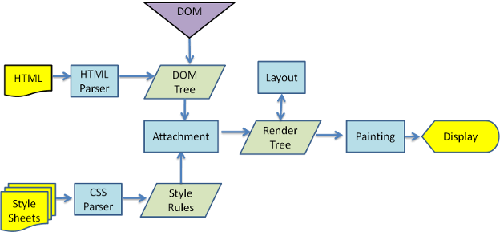

# 一、页面渲染过程  
[阮一峰老师博客](http://www.ruanyifeng.com/blog/2015/09/web-page-performance-in-depth.html)  
~~~
1. 解析HTML，得到一个DOM tree  
   1. DOM树在构建的过程中可能会被CSS和JS的加载而执行阻塞。
   2. display:none 的元素也会在DOM树中。
   3. 注释、<script>标签也会在DOM树中
2. 解析CSS，得到CSSOM tree  
   1. CSS解析可以与DOM解析同进行。
   2. CSS解析与script的执行互斥 。
   3. 在Webkit内核中进行了script执行优化，只有在JS访问CSS时才会发生互斥。
3. 将两者整合成渲染树，render tree  
   1. Render Tree和DOM Tree不完全对应。
   2. display: none的元素不在Render Tree中
   3. visibility: hidden的元素在Render Tree中
4. 布局（layout），根据Render Tree计算每个节点的位置大小等信息,将所有渲染树的所有节点进行平面合成  
   1. 我们常说的脱离文档流，其实就是脱离Render Tree。
5. 绘制（Painting ）根据计算好的信息绘制整个页面

"生成布局"（flow）和"绘制"（paint）这两步，合称为"渲染"（render）。  
~~~  
  
脚本解析会将脚本中改变DOM和CSS的地方分别解析出来，追加到DOM Tree和Style Rules上。
CSS 被默认被视为阻塞渲染的资源，因此浏览器将在 CSSOM 构建完毕前不会渲染任何已处理的内容。

JavaScript 不仅可以读取和修改 DOM 属性，还可以读取和修改 CSSOM 属性，因此CSS解析与script的执行互斥。

1、2、3非常快，但是4和5比较耗时。重排和重绘代价很高，所以浏览器并不会一有信息改变就去执行重排和重绘，而是会将多个可能的重排和重绘一次执行。即它可能会异步。
## 1.1 原理解析  
**白话说明**  
浏览器在渲染网页时会开启两条线程，渲染引擎线程和JS引擎线程，但这两条线程是互斥的，同时只能有一个线程在执行。也就是说在构建DOM树时，渲染引擎在执行：

当遇到JS时：  
渲染引擎会停止执行，控制权交给JS引擎，当执行JS代码时
如果遇到获取DOM，那么如果该DOM还没有解析，则会获取为null，如果JS代码还操作了CSS，而这个CSS如果还没有下载和构建，那么浏览器首先会阻塞JS引擎执行，然后会开启一个异步请求线程，在该线程上，去下载构建CSS规则树，CSS规则树构建完成后，再继续执行JS代码，当JS执行完以后，控制权再次交给渲染引擎去执行。

当遇到CSS元素时：  
也会开启异步线程，去下载构建CSS规则树，但同时也会继续构建后面的DOM树，也就是说DOM解析和CSS解析可以同时进行，但如果后面遇到JS元素，则会阻塞JS引擎线程执行，后面DOM树解析不受影响。  
~~~  
浏览器渲染网页阻塞顺序
1：构建DOM树时，如遇到JS元素时，会阻塞DOM树和CSS规则树的构建，优先执行JS文件

2：构建DOM树时，如遇到CSS元素时，会开启异步请求线程，该线程会先下载CSS文件，再构建CSS规则树，该线程会阻塞JavaScript引擎线程，但不会阻塞DOM树的构建

3：CSS解析和JS解析互斥，也就是说JS解析时会阻塞CSS解析而CSS解析时也会阻塞JS解析

4：JS解析时，如果JS还操作了CSS，而这个CSS还没有下载或构建解析，则会延迟执行JS，直到完成CSS下载构建解析，再会继续执行JS
~~~

# 二、脚本位置  
~~~  
CSS和JS引入位置说明
1：CSS资源尽量放在head部分
2：JS资源尽量放在body结束标签之前
3：CSS资源尽量优先于JS资源引入
~~~
1. js文件引入位置  
head元素中包含所有JavaScript文件意味着必须等到全部js代码都被下载解析和执行完成后才能开按时呈现页面内容
（浏览器遇到body标签才开始呈现内容），这在js下载量很大时会导致页面延迟。未解决这个问题，现代许多web应用将js引入
放在body标签中页面内容的后面  
2. 完整JavaScript实际上是包含ECMAScript、DOM、BOM的。  
3. 延迟脚本：给引入外部脚本文件的\<script\>标签定义defer属性。这个属性告诉浏览器立即下载，但延迟执行。脚本会被延迟到整个页面都解析完毕后再运行。  
3. 异步脚本：给脚本定义async属性，类似defer，但是下载就马上执行。  

# 三、页面性能  
提高网页性能，就是要降低"重排"和"重绘"的频率和成本，尽量少触发重新渲染。
~~~  
提高性能的方法：  
1. DOM的多个读操作和写操作放在一起，不要夹。
   浏览器本身会进行异步合并优化，但如果后续操作直接需要用到重绘后的属性，则会先进行单独的重绘。
2. 不要一条条改变样式，通过改变class或者cssText或者替换节点（节点克隆）直接一次性改变样式。
3. 先display：none，在进行许多次操作，再显示出来，这样也仅仅会导致两次重新渲染而已。
~~~