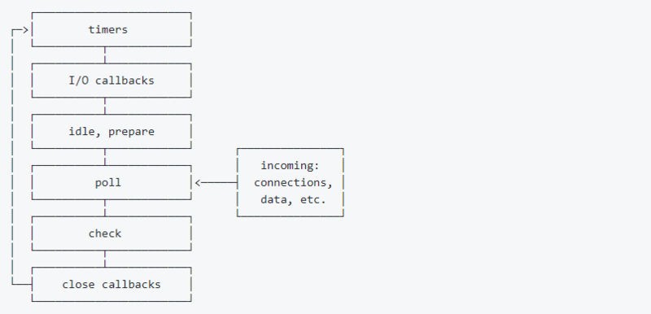

## 事件循环原理  
1. node 的初始化  
    + 初始化 node 环境。
    + 执行输入代码。
    + 执行 process.nextTick 回调。
    + 执行 microtasks。  
2. event-loop  
  
## Event-loop  
timers => IO callback => idle => prepare => poll => check => close callback  
  
1. timers阶段：这个阶段执行已经到期的timer(setTimeout、setInterval)回调
2. I/O callbacks阶段：执行I/O（例如文件、网络）的回调
3. idle, prepare 阶段：node内部使用
4. poll阶段：获取新的I/O事件, 适当的条件下node将阻塞在这里
5. check阶段：执行setImmediate回调
6. close callbacks阶段：执行close事件回调，比如TCP断开连接  

~~~
1. 进入 timers 阶段
  检查 timer 队列是否有到期的 timer 回调，如果有，将到期的 timer 回调按照 timerId 升序执行。
  检查是否有 process.nextTick 任务，如果有，全部执行。
  检查是否有microtask，如果有，全部执行。
  退出该阶段。

2. 进入IO callbacks阶段。
  检查是否有 pending 的 I/O 回调。如果有，执行回调。如果没有，退出该阶段。
  检查是否有 process.nextTick 任务，如果有，全部执行。
  检查是否有microtask，如果有，全部执行。
  退出该阶段。

3. 进入 idle，prepare 阶段：
这两个阶段与我们编程关系不大，暂且按下不表。

4. 进入 poll 阶段
  (1)首先检查是否存在尚未完成的回调，如果存在，那么分两种情况。
    第一种情况：
    如果有可用回调（可用回调包含到期的定时器还有一些IO事件等），执行所有可用回调。
    检查是否有 process.nextTick 回调，如果有，全部执行。
    检查是否有 microtaks，如果有，全部执行。
    退出该阶段。
  
    第二种情况：
    如果没有可用回调。
    检查是否有 immediate 回调，如果有，退出 poll 阶段。如果没有，阻塞在此阶段，等待新的事件通知。

  (2)如果不存在尚未完成的回调，退出poll阶段。

5. 进入 check 阶段。

  如果有immediate回调，则执行所有immediate回调。
  检查是否有 process.nextTick 回调，如果有，全部执行。
  检查是否有 microtaks，如果有，全部执行。
  退出 check 阶段

6. 进入 closing 阶段。

  如果有immediate回调，则执行所有immediate回调。
  检查是否有 process.nextTick 回调，如果有，全部执行。
  检查是否有 microtaks，如果有，全部执行。
  退出 closing 阶段

7. 检查是否有活跃的 handles（定时器、IO等事件句柄）。
  如果有，继续下一轮循环。
  如果没有，结束事件循环，退出程序。  
~~~  
## setImmediate 和 process.nextTick  
[文章解析](https://segmentfault.com/a/1190000013102056)  
相对于浏览器环境，node环境下多出了setImmediate和process.nextTick这两种异步操作。setImmediate的回调函数是被放在check阶段执行，即相当于事件循环的最后阶段了。而process.nextTick会被当做一种microtask，前面提到每个阶段结束后都会执行所有microtask任务，所以process.nextTick有种类似于插队的作用，可以赶在下个阶段前执行
1. 在行为上,process.nextTick()在每轮循环中会将数组中的回调函数全部执行完.
   而setImmediate()在每轮循环中执行链表中的一个回调函数.