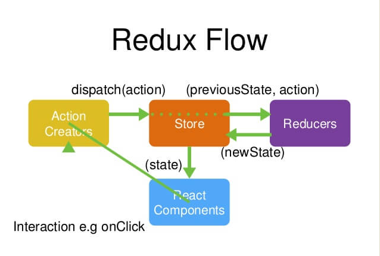

# redux中间件  
## 一、redux原理简单回顾  
### 1.基本  

四个概念：Action Creator, store, reducer, Views(React Components)  
~~~  
1. Views(React Components): 用户直接接触的组件，含action creator函数
2. Action Creator： 函数。派发action对象 => store.dispatch(action);改变 State 的唯一办法
3. store: 数据中心，存储state；收到action后，去调用reducer，然后接受reducer返回的新state生成新的View
4. reducer: 纯函数。
~~~
### 2. 流程：
~~~  
1. 用户在View通过Action Creator发出（dispatch）Action。   
2. Store接收到action后，自动调用 Reducer，并且传入两个参数：(previous State,action)  
3. Reducer根据action和previous state返回新的 State  
4. store接受新的state，更新View
~~~
## 二、redux中间件  
原理：改装dispatch，使得可以action可以是一个函数。和immutable搭配性能会十分好。  
首先检查参数 action 的类型，如果是函数的话，就执行这个 action 函数，并把 dispatch, getState, extraArgument 作为参数传递进去，
```  
function createThunkMiddleware(extraArgument) {
  return ({ dispatch, getState }) => (next) => (action) => {
    if (typeof action === 'function') {
      return action(dispatch, getState, extraArgument);
    }

    return next(action);
  };
}

const thunk = createThunkMiddleware();
thunk.withExtraArgument = createThunkMiddleware;

export default thunk;
```  
[](https://www.cnblogs.com/rock-roll/p/10763383.html)  
[](https://www.jianshu.com/p/a4ab789790b2)
