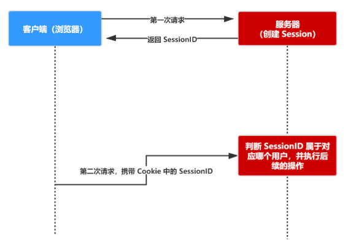
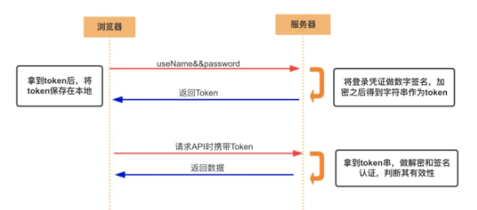
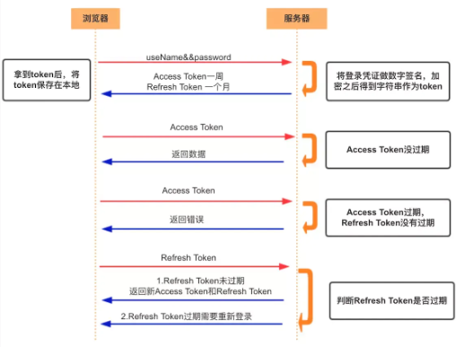

## 一、验证的三种机制  
1. 认证：验证当前用户身份，如账号密码、验证码等  
2. 授权：授予第三方某些用户权限  
3. 凭证：认证和授权都需要某些凭证证明用户身份  
  
web应用用作凭证的有以下几种：  
## 二、凭证方式/种类  
### 1. Cookie与session  
1. cookie用于解决HTTP无状态的特征
   1. 存储在客户端  
   2. 不可跨域  
   3. 浏览器对单个cookie大小和同一域名下的cookie有数量限制  
2. session基于 cookie 实现的，session 存储在服务器端，sessionId 会被存储到客户端的cookie 中  
3. session 认证流程：
   + 用户第一次请求服务器的时候，服务器根据用户提交的相关信息，创建对应的 Session
   + 请求返回时将此 Session 的唯一标识信息 SessionID 返回给浏览器
   + 浏览器接收到服务器返回的 SessionID 信息后，会将此信息存入到 Cookie 中，同时 Cookie 记录此 SessionID 属于哪个域名
   + 当用户第二次访问服务器的时候，请求会自动判断此域名下是否存在 Cookie 信息，如果存在自动将 Cookie 信息也发送给服务端，服务端会从 Cookie 中获取 SessionID，再根据 SessionID 查找对应的 Session 信息，如果没有找到说明用户没有登录或者登录失效，如果找到 Session 证明用户已经登录可执行后面操作。

   根据以上流程可知，SessionID 是连接 Cookie 和 Session 的一道桥梁，大部分系统也是根据此原理来验证用户登录状态。  
     
4. 比较不同：  
   + 安全性： Session 比 Cookie 安全，Session 是存储在服务器端的，Cookie 是存储在客户端的。
   + 存取值的类型不同：Cookie 只支持存字符串数据，想要设置其他类型的数据，需要将其转换成字符串，Session 可以存任意数据类型。
   + 有效期不同： Cookie 可设置为长时间保持，比如我们经常使用的默认登录功能，Session 一般失效时间较短，客户端关闭（默认情况下）或者 Session 超时都会失效。
   + 存储大小不同： 单个 Cookie 保存的数据不能超过 4K，Session 可存储数据远高于 Cookie，但是当访问量过多，会占用过多的服务器资源。
### 2.token  
1. Access Token  
    token通常是访问资源接口（API）时所需要的资源凭证。通常由用户ID：uid、生成的时间戳：time和签名：sign（token 的前几位以哈希算法压缩成的一定长度的十六进制字符串）组成  
    ~~~  
    特点：
    1. 保存在客户端(存在cookie或者localstorage中或其他本地)，每一次请求都需要携带 token，需要把 token 放到 HTTP 的 Header 里或者当做url参数。
    2. 服务端无状态存储，服务端不用存放 token 数据。用解析 token 的计算时间换取 session 的存储空间，从而减轻服务器的压力，减少频繁的查询数据库
    3. token 完全由应用管理，所以它可以避开同源策略
    ~~~
      
    
2. Refresh Token  
   专用于刷新 access token 的 token。  
     
3. 比对  
   1. 需要共享数据，用token，因为可以跨域  
### 3. JWT  
1. 基于token，服务器无状态  
2. 发送签名后的JSON：Header.Payload.Signature  
#### （1）Header  
Header 部分是一个 JSON 对象，描述 JWT 的元数据
```  
{
  "alg": "HS256",   //alg属性表示签名的算法（algorithm），默认是 HMAC SHA256（写成 HS256）
  "typ": "JWT"      //typ属性表示这个令牌（token）的类型（type），JWT 令牌统一写为JWT。
}
```  
#### （2）payload  
Payload 部分也是一个 JSON 对象，用来存放实际需要传递的数据。JWT 规定了7个官方字段
```  
// Of course, you can define your own header.
iss (issuer)：签发人
exp (expiration time)：过期时间
sub (subject)：主题
aud (audience)：受众
nbf (Not Before)：生效时间
iat (Issued At)：签发时间
jti (JWT ID)：编号
```  
这个 JSON 对象也要使用 Base64URL 算法转成字符串。  
#### （3）Signature  
Signature 部分是对前两部分的签名，防止数据篡改。  
签名公式：  
```  
// 使用Header中指定的算法
HMACSHA256(
  base64UrlEncode(header) + "." +
  base64UrlEncode(payload),
  secret)         //secret为只有服务器知道的密钥
```  

> 注意：   
> Header 和 Payload 串型化的算法是 Base64URL。这个算法跟 Base64 算法基本类似，但有一些小的不同。  
>   
> JWT 作为一个令牌（token），有些场合可能会放到 URL（比如 api.example.com/?token=xxx）。Base64 有三个字符+、/和=，在 URL 里面有特殊含义，所以要被替换掉：=被省略、+替换成-，/替换成_ 。这就是 Base64URL 算法。  
#### （4）使用方式  
1. 存放cookie(不能跨域，请求时自动发送)，也可以存在localstorage，可以放在HTTP请求头的Authorization字段。  

   另一种做法是，跨域的时候，JWT 就放在 POST 请求的数据体里面。  
2. 默认不加密  
3. 最大缺点是，由于服务器不保存 session 状态，因此无法在使用过程中废止某个 token，或者更改 token 的权限。也就是说，一旦 JWT 签发了，在到期之前就会始终有效，除非服务器部署额外的逻辑。  
4. 本身包含了认证信息，一旦泄露，任何人都可以获得该令牌的所有权限。为了减少盗用，JWT 的有效期应该设置得比较短。对于一些比较重要的权限，使用时应该再次对用户进行认证。  
5. 为了减少盗用，JWT 不应该使用 HTTP 协议明码传输，要使用 HTTPS 协议传输。
