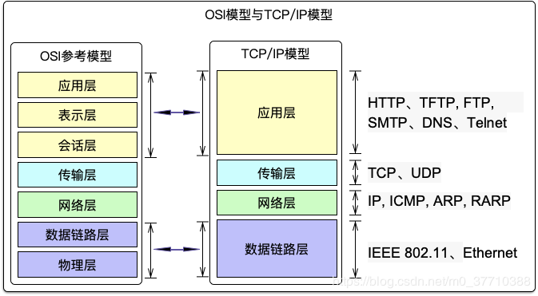
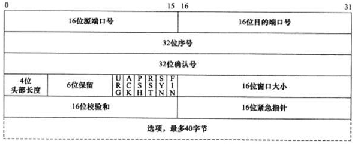
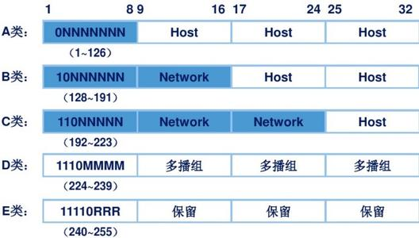

# 网络层次模型与协议  
## 一、OSI七层模型  
### 简介
由ISO（国际标准化组织）指定的标准通讯层次模型，从上至下：    
1.应用层：应用程序接口  
2.表示层：数据转换加密和压缩  
3.会话层：建立、管理、控制网络连接和终止  
4.传输层：控制数据传输的可靠性  
5.网络层：提供网络互联。路由等功能，三层设备（路由功能）  
6.数据链路层：封装数据成帧；提供节点之间的传输，二层设备（交换功能）  
7.物理层：指定物理设备标准  

## 二、TCP-IP  
### 模型理解与数据传输原理  
TCP-IP模型为OSI模型的简化，四层：应用层、传输层、网络层、数据链路层；可以借助OSI七层模型来理解：
  
封装过程：
1. 应用层  
   OSI中：应用层产生数据，表示层对数据进行加密与压缩，会话层确认链接状态 => 整合为应用层，产生需要传输的数据，加了ftp头  
2. 传输层  
   OSI中：传输层给数据添加TCP报头，给数据加上对应的服务源和目的端口 => 数据初加工  
3. 网络层  
   OSI中：网络层给数据IP报头，加上源IP地址和目的IP地址 => 数据二次加工  
4. 数据链路层  
   OSI中：数据链路层加上MAC报头，源和目的mac地址,再由物理层转为电信号比特流在设备上传输 => 数据第三次加工  
  
解封装：其他端接收到信息后从下至上依次解封装数据，确认目的地址是自身在进行下次解封装，如若不是，则丢弃或者转发（路由器）  
  
  
### TCP与UDP  
tcp协议:传输控制协议。面向连接的可靠网络协议  
udp协议:用户报文协议。无连接的不可靠网络协议  
### TCP报文  
  
#### 链接过程：三次握手  
1. A请求链接B：向B发送TCP报文，序列号seq=x(初始为0，递增)，控制字段syn置为1，请求建立连接  
2. B收到请求后回复：向A发送TCP报文，序列号seq=y，确认号ACK=x+1，控制字段ack置为1（表示收到请求），syn置为1（表示请求与A建立连接）  
3. A收到B的回复后再回复B：向B发送TCP报文，确认号=y+1，ack置为1  
#### 断开连接：四次挥手  
1. A请求断开B的连接：ack=1,fin=1  
2. B回复A：ack=1  
3. B请求断开A的连接：ack=1,fin=1  
4. A回复B：ack=1  

同时也会有序列号和确认号的发送，遵循握手时的递增原理。  
挥手比握手多一次是为了确保信息传输完成（一方发起断开时另一方可能还未传输完数据）  
特殊情况：如果断开连接时，还未收到确认（网络延迟等）便收到FIN，则提前进入FIN_wait2  
#### TCP十一种状态  
1. 关闭closed  
2. 服务器开启响应服务,建立socket：listen  
3. 客户端向服务端发起请求：syn_sent  
4. 服务端接受请求并确认：sys_rcvd  
5. 客户端再次确认,链接建立：established  
6. 发送断开请求：fin_wait1  
7. 服务端接收到断开请求：close_wait  
8. 客户端收到确认信息：fin_wait2  
9. 服务端发送断开请求：last_ack  
10. 客户端收到断开请求,发送确认：time_wait（之后客户端会等待一段时间，变成closed），三次挥手中会先进入closing再进入time_wait  
11. 服务端收到确认信息：closed
## 重要协议  
### 1.DNS域名解析协议  
+ 作用：  
建立域名与IP地址的对应关系，将域名解析成IP地址  
+ 原理：  
访问一个域名时，会按顺序访问本地DNS缓存、本地hosts文件、LDNS服务器，直到找到映射关系为止（递归查询）。   
LDNS服务器会依次访问根域名服务器、一级域名服务器、二级域名服务器（也叫授权DNS服务器），找到A记录信息，即域名与IP的对应记录，返回记录（迭代查询）。  
### 2.ARP地址解析协议  
+ 作用：  
网络通讯过程中，初始主机间往往只清楚IP地址而不清楚Mac地址（此时需要广播），ARP协议通过建立ARP表，存储MAC地址与IP地址的映射表，解决这个问题，同时避免了交换机重复广播问题。  
+ 原理：  
起初通讯时，在广播时记录下对应的mac地址与IP信息，下次通讯即可实现精确查找通讯  
### 3.IP互联网协议地址  
**作用**:IP地址用于标识网络位置，方便网络通讯  

**IP地址**：IP地址大小为32bit，IPV4即取4个8位的十进制标识，即4个0~255（2**8）间的数字标识  
  
**IP地址分类：**  
+ 按照地址范围划分：A、B、C、D类  
+ 按照地址用途划分：公网地址、私网地址（需要用到NAT网络地址转换）  
+ 按照通讯方式划分：  
   单播地址：往卡上配置的地址  
   广播地址：主机位全为1的地址，即主机位为255;主机位全为0的地址即主机位为0,是网段地址；  
   组播地址：D类地址  
  
通常网络可配置的主机数量为2**(主机位位数)-2-1，减去的是广播地址、网段地址和路由器网关地址
### 4.NAT网络地址转换  
+ 作用:  
不同局域网的私网地址的IP地址可能重复，为了避免在公网上重复，对网络地址进行转换，通常是转化为网关路由器的公网IP地址  
### 5.DHCP动态主机配置协议  
作用：给网络中的主机分配地址  
原理：
1. 网络中主机发送广播信息  
2. DHCP服务器收到后相应广播信息，从IP地址范围中分配一个给该主机  
3. 主机收到后返回确认信息，自动配置地址信息。  
4. DHCP服务器接受确认信息，并删除地址范围中的相应地址，避免重复使用  
5. 使用时间到后，服务器会询问是否续租，无回应和拒绝将回收地址（故服务器需要静态配置地址）
  

